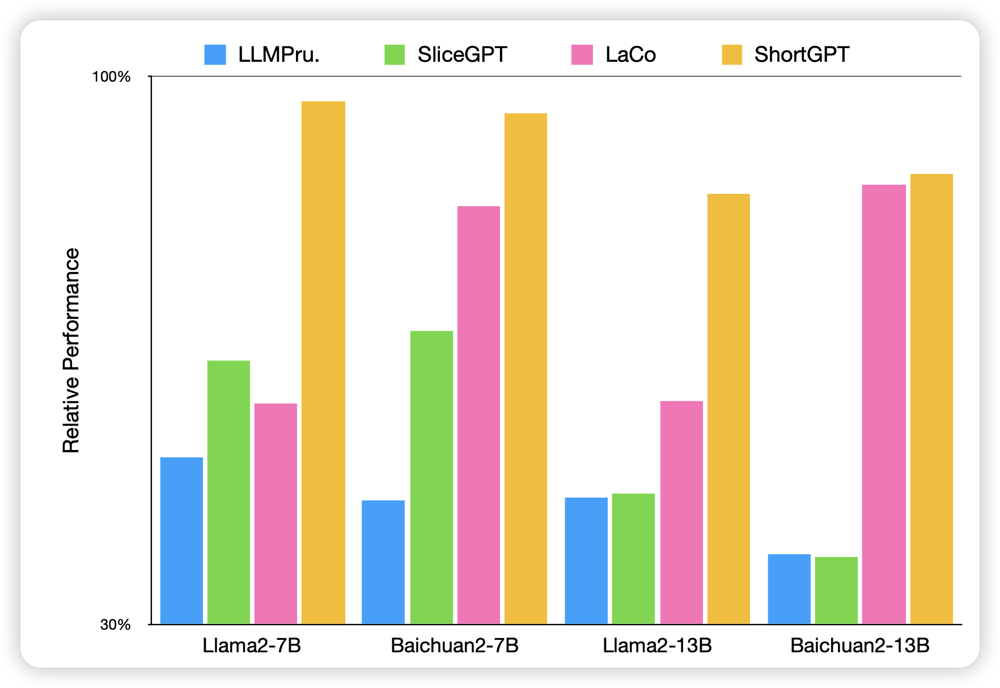

怎么读论文数一周没涨了……可恶，不能再这样下去了

## [ShortGPT: Layers in Large Language Models are More Redundant Than You Expect](https://arxiv.org/pdf/2403.03853.pdf)

一篇模型剪枝的研究：作者发现，大模型中绝大多数的layer都对结果几乎没有贡献。作者就想到，直接按照贡献度把一些layer整个删掉，然后发现这种方法剪枝，模型的留存性能竟然比其他方法好很多

