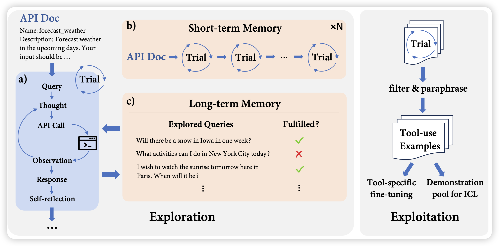
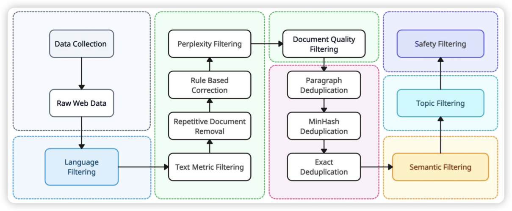

## [LLMs in the Imaginarium: Tool Learning through Simulated Trial and Error](https://arxiv.org/pdf/2403.04746.pdf)

ToolLLM的质量挺不错的follow up工作：作者认为toolLLM对于单个tool，即使在训练集里的准确率也并不够好。实际上，这是因为训练集里可能有一些数据过期等问题。通过一个short term memory，让模型可以通过一些幻想出来的场景去试探，可以持续地为工具收集数据，用做后续的ICL或者finetune。通过这种方案，可以更好的维持模型工具调用能力

## [Yi: Open Foundation Models by 01.AI](https://arxiv.org/pdf/2403.04652.pdf)

开源的7B和34B模型：作者发现，更多的数据工程是更好的表现的根本来源。并做了一个长达15个步骤的清洗流程，最终训练出了一个很好的语言模型

> 很可惜，3.4T token高质量语料没开源

