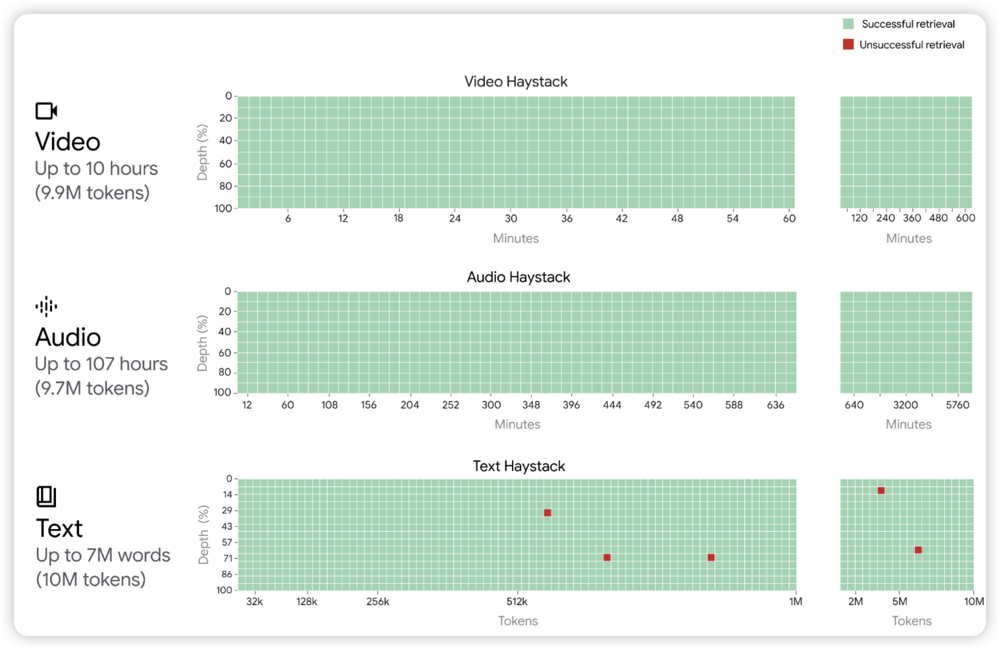

300引！在$\log$​的尺度上算是100和1000印的中间节点了。感觉ToolBench和之前Survey的热度快到头了，想再长引用这学期还得发掘几个新的增长点

## [DeepSeek-VL: Towards Real-World Vision-Language Understanding](https://arxiv.org/pdf/2403.05525.pdf)

上周五的论文，不过发在了AI track没看到，今天补上。目前世界上效果最好的开源MLLM了。作者做了一个大创新：从纯文本开始训练MLLM，叫做"modal warm-up"。作者最开始只有text，随着训练逐渐增加image-text的占比。同时，把分辨率卷到了目前最高的1024x1024

> 他甚至开源了，你还能说什么……不过我一直想吐槽这个logo像是orca的logo来着

## [Gemini 1.5: Unlocking multimodal understanding across millions of tokens of context](https://arxiv.org/pdf/2403.05530.pdf)

虽然是很久之前的工作了，但gemini 1.5的论文还是得推一下的。作者用了两个例子讲他们有多强：

1. 在视频、音频、文本联合编码的next token prediction方法下，gemini在10M token，即10hour视频下仍然能做到几乎完美的大海捞针。
2. 对于Kalamang，世界上只有200人在用并且没有语料的语言。给定一些规则后，gemini可以和人类类似水平地做kalamang的翻译

> 除了被sora一天发布创了，没什么多说的

