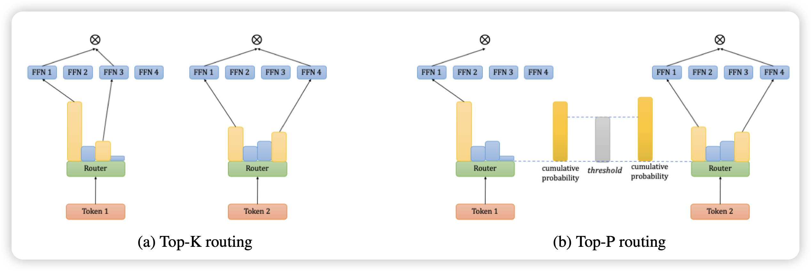
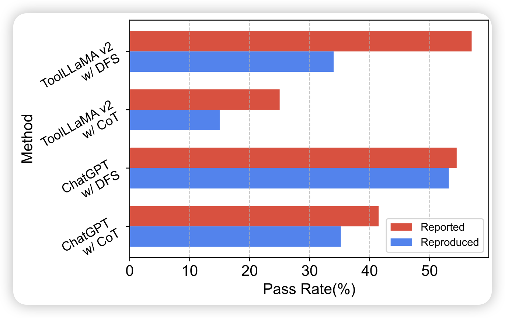
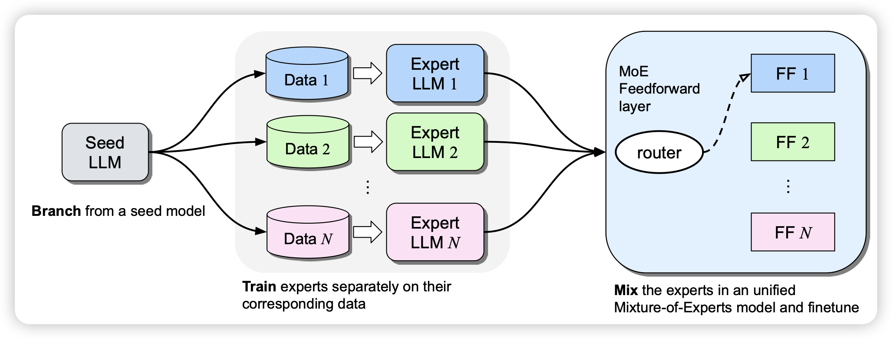

## [Harder Tasks Need More Experts: Dynamic Routing in MoE Models](https://arxiv.org/pdf/2403.07652.pdf)

之前的MoE模型都是有一个router，返回这个token对于每个expert的softmax概率，然后取前两名激活。

作者这里想的问题是：能不能把topk换成top-p?即softmax里激活的experts总体概率大于某个阈值？这样可以把困难的token分配更多的资源，简单的token分配更少的experts。作者发现这样训练出来的模型效果比之前的更好

## [StableToolBench: Towards Stable Large-Scale Benchmarking on Tool Learning of Large Language Models](https://arxiv.org/pdf/2403.07714.pdf)

推荐一下我们组的工作：之前很火的ToolBench面临一个比较大的问题，每时每刻16000个API都有一些不能用。所以，每一篇工作的方法实际上都是无法复现的，因为测试时间不同。所以这篇工作制作了一个fake版本的toolbench，用3.5假装一个tool，根据曾经这个tool的输入输出给定一个输出，这样测试就相对比较稳定了。

## [Branch-Train-MiX: Mixing Expert LLMs into a Mixture-of-Experts LLM](https://arxiv.org/pdf/2403.07816.pdf)

Meta的新论文，名字像是在致敬之前的Branch-train-merge。作者从一个checkpoint出发，在几个不同的数据subset上分别训练一下变成几个不同的模型，最后把他们的FFN拿出来merge在一起，变成了一个MoE模型。很有趣的思路

