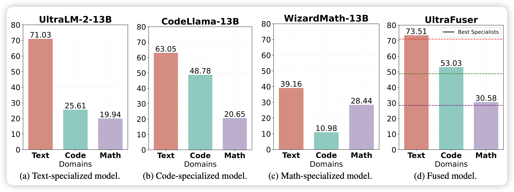
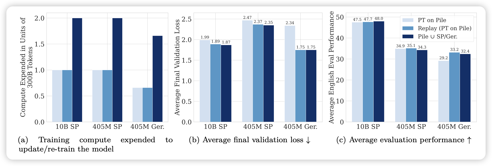
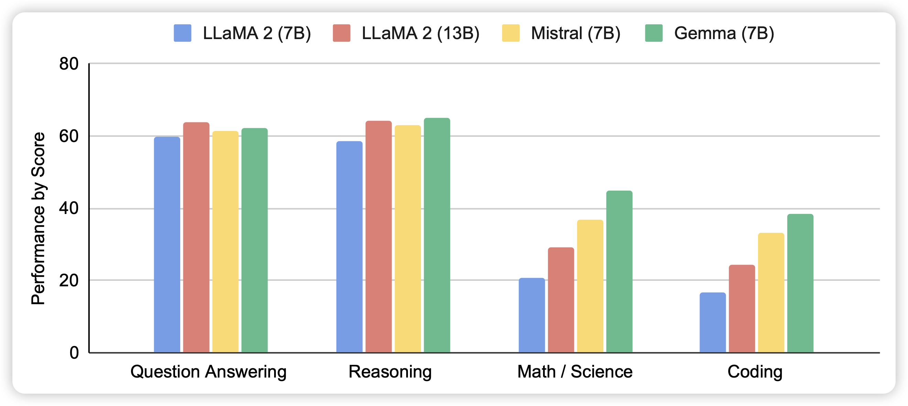

## [Mastering Text, Code and Math Simultaneously via Fusing Highly Specialized Language Models](https://arxiv.org/pdf/2403.08281.pdf)

推荐Ning Ding师兄的论文，和前两天meta的branch-train-mix很类似：能不能把几个在专门领域上特化的模型merge成为一个MoE专家呢？感觉这招能走通的话，这些公司可以把市面上的所有开源模型llama gemma mixtral之类的都merge进来，再开始continue-pretrain了

## [Simple and Scalable Strategies to Continually Pre-train Large Language Models](https://arxiv.org/pdf/2403.08763.pdf)

作者探索了一个简单的问题：如何让模型可以近乎无损的在新找来的数据集上continue-pretrain？作者发现一个简单的招数，学习率的re-warming\re-decaying和重放之前的训练数据，就可以大概做到这件事

> 话说如果这个可以的话，我是不是可以最开始训模型时在快速退火前先保存一份，然后再训。以后continue-pretrain时直接用前面那个退货前的ckpt load来继续？

## [Gemma: Open Models Based on Gemini Research and Technology](https://arxiv.org/pdf/2403.08295.pdf)

Gemma的论文，不知道为啥现在才出。看这个score估计是没刷榜

