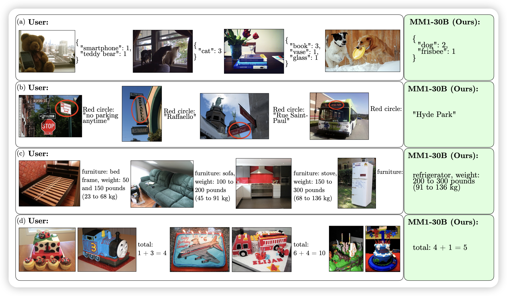
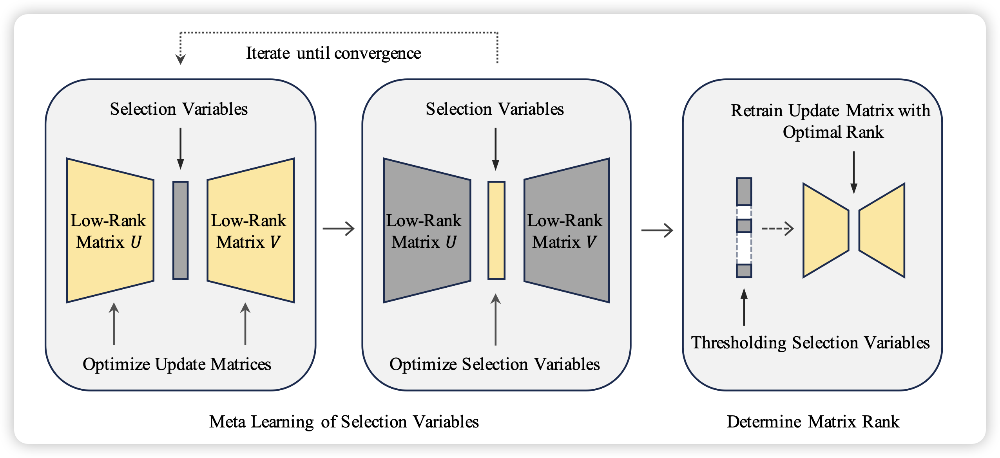
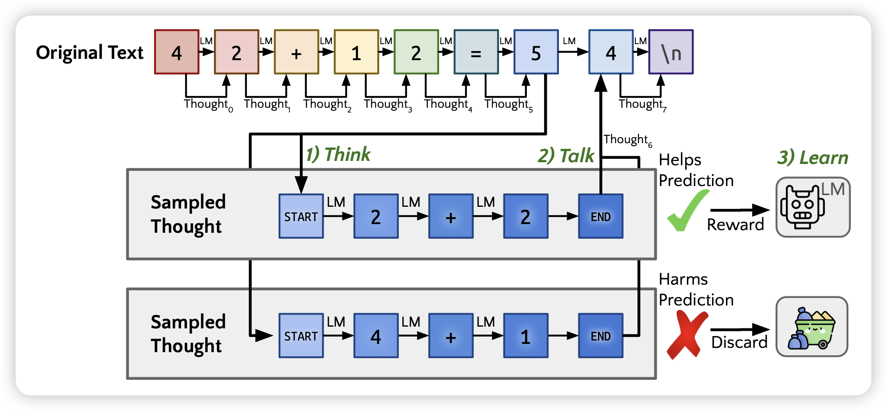

论文不多，但都挺好玩的

## [MM1: Methods, Analysis & Insights from Multimodal LLM Pre-training](https://arxiv.org/pdf/2403.09611.pdf)

Apple的大模型，这下不得不推荐了？作者探索了MultiModal模型的训练策略，尝试了各种变体，发现：

1. 好的模型需要是image-caption 、interleaved image-text、text-only三种数据的混合
2. image-encoder的分辨率和选型对结果影响最大，aligner和text-decoder其实影响不大

由此，作者训了一个30B的MultiModal的大模型，有dense和MoE两个变体，并取得了很多的emergent abilities。

> 起名字有一种浓浓的apple风格……

## [AutoLoRA: Automatically Tuning Matrix Ranks in Low-Rank Adaptation Based on Meta Learning](https://arxiv.org/pdf/2403.09113.pdf)

作者发现，对于lora训练，其中的秩rank是一个影响很大的参数：rank大效果好，参数也多；反之亦然。如何自动地决定rank是多少呢？作者尝试了一个meta learning framework，可以根据任务特征帮助模型决定rank的大小。发现效果不错

> 我一直在想，这个问题能不能推广到运行时？比如训练中发现某个层基本梯度很小了，就砍一个rank；某些层总是优化不好，就加一个rank……

## [Quiet-STaR: Language Models Can Teach Themselves to Think Before Speaking](https://arxiv.org/pdf/2403.09629.pdf)

Noah.D Goodman的论文，一做是之前STaR的一作，作者结合了之前有一篇叫"think before you speak"的工作，探索了模型能不能在任何一个token predict之前生成一些thought。

类似于STaR的思路，作者让模型开放探索，如果thought token对target-next-token logits有帮助，就给正反馈，否则给负反馈。作者发现这样在一个无监督的训练框架在某个数据集上训练以后，效果提升还挺明显的

> 有点神奇

