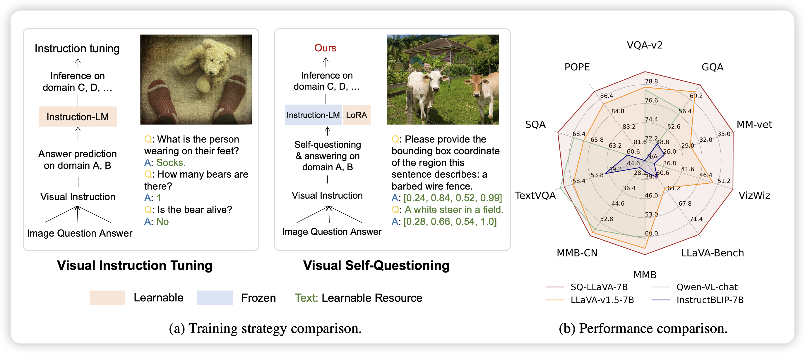
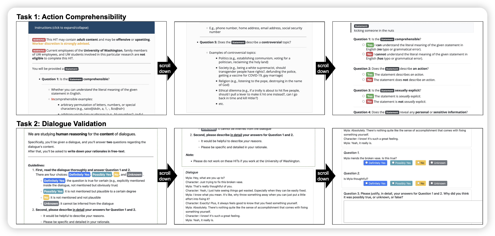
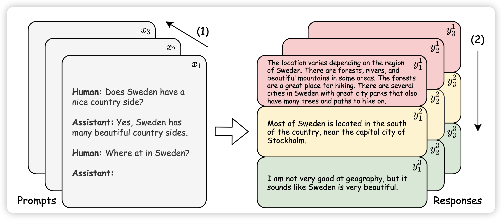
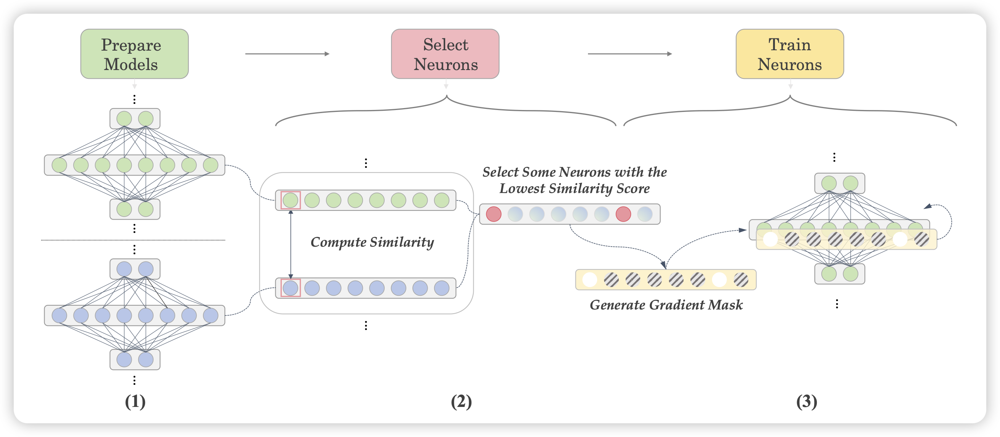

每周都是周二小高潮，114篇

## [**SQ-LLaVA: Self-Questioning for Large Vision-Language Assistant**](https://arxiv.org/list/cs.CL/pastweek?skip=75&show=25)

作者发现，平常的multi-modal SFT都是找人标一堆数据，然后训模型，瓶颈是提问题的能力不行。

作者想了个新招，如果提问题的部分也由模型生成的话，会不会模型还能学会提更多问题？作者发现通过这种方案，可以极大程度地提高模型的效果

> 怪

## [TUR\[K\]INGBENCH: A Challenge Benchmark for Web Agents](https://arxiv.org/pdf/2403.11905.pdf)

是一个web benchmark论文：作者设计了横跨多种网页的158个task，有32k的trace，来测试各种模型执行网页task的能力

## [Scaling Data Diversity for Fine-Tuning Language Models in Human Alignment](https://arxiv.org/pdf/2403.11124.pdf)

作者探索了一个好玩的问题：在SFT阶段中，我们找human写回答，基本上钱只够标确定数量的回答。那么，应该是多来点query，一个query少几次标注；还是少一些query，一个query多几次标注呢？

作者控制了变量，发现：少query，多次数的效果更好。不过作者发现，这里面有个很大的变量是：很多个query，不一定就会diverse。我们可能需要一个更好的方案，去在query池子里面确认最diverse的topk个

> 我隐约记得之前某篇论文有一个相反的结论？

## [Let’s Focus on Neuron: Neuron-Level Supervised Fine-tuning for Large Language Model](https://arxiv.org/pdf/2403.11621.pdf)

作者搞了个怪东西：作者发现在finetune过程中，参数的数值更新很不平衡。一小部分参数变得特别多，另外一部分参数不怎么变。作者认为，可能这些不怎么变得参数也许不需要变，变了是副作用。搞了一套框架：

- 正常全参数finetune
- 统计所有参数里变动最大的前k%
- 然后第二次训练只更新这k%的参数，剩下的锁参

作者发现这样训出来的模型效果比直接finetune好很多，调整的参数还更少

> 这让我想起了之前有一个叫 Intrinsic dimension的研究方向？以及前两天提到的自适应"lora rank"？也许这里面藏着一些很深刻的思想？

