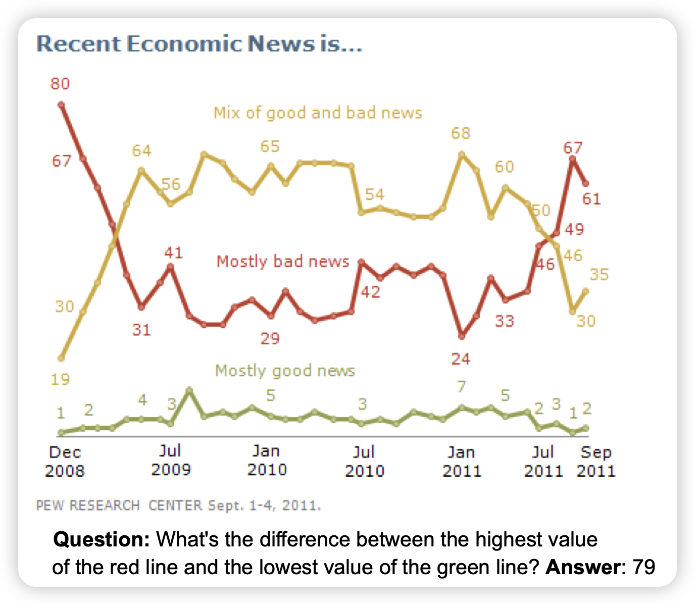
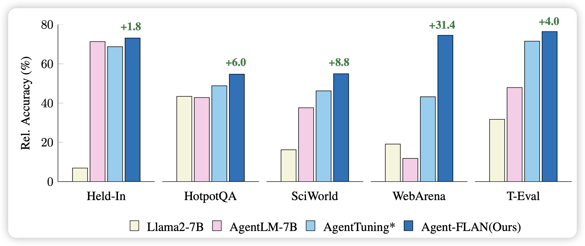

## [Chart-based Reasoning: Transferring Capabilities from LLMs to VLMs](https://arxiv.org/pdf/2403.12596.pdf)

来自google的工作：作者用chart场景，探索了能否把一个llm的推理能力蒸馏给vlm模型，并发现了一些insights

## [Agent-FLAN: Designing Data and Methods of Effective Agent Tuning for Large Language Models](https://arxiv.org/pdf/2403.12881.pdf)

之前唐杰老师的agenttuning的一篇不错的后继工作：作者探索了之前的agent tuning类工作的三个问题：

1. 训练数据里 format-following和reasoning的能力需求耦合在一起
2. 模型对于agent不同sub ability的学习速度不一样
3. 很多内容太难了，导致模型learn-to-hallucinate

经过好的设计，作者极大地提升了agent tuning的效果

