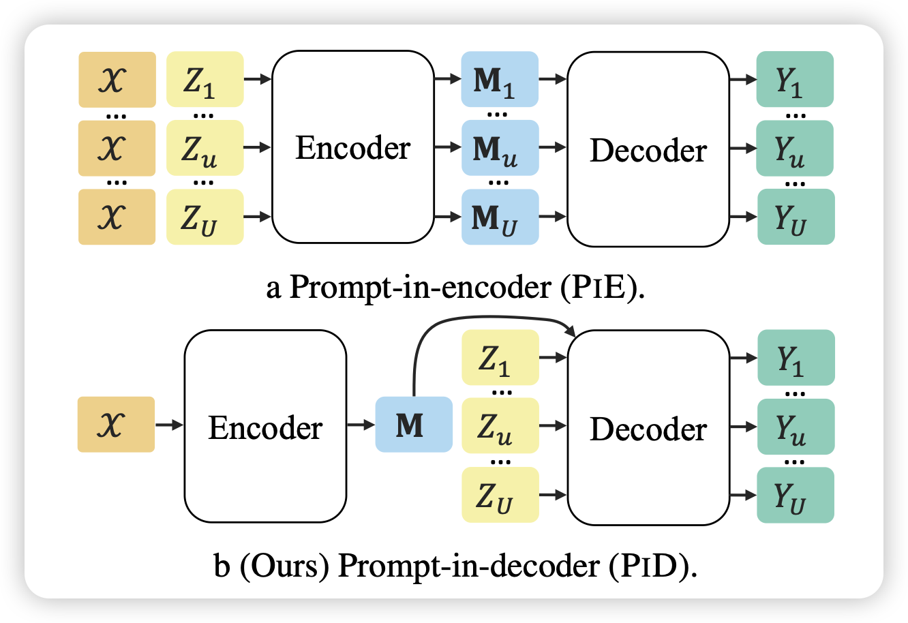
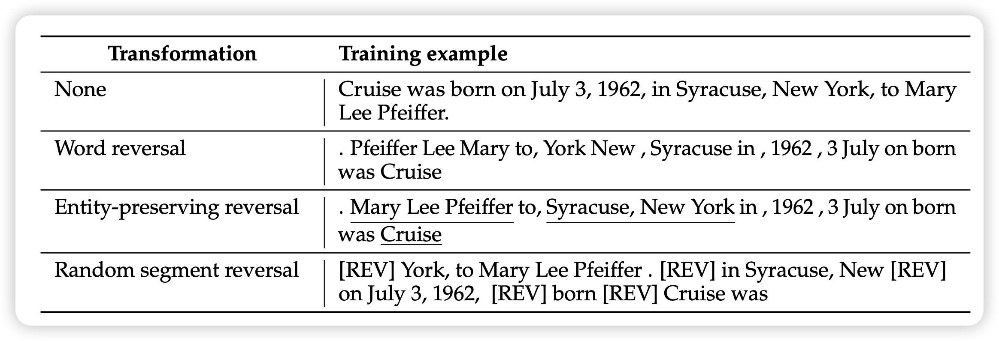

## [Encode Once and Decode in Parallel: Efficient Transformer Decoding](https://arxiv.org/pdf/2403.13112.pdf)

作者发现之前的instruction tuning常常会finetune encoder-decoder模型，然后一直都是instruction+input放进encoder。但是实际情况是input往往会由于不同的instruction去复用很多遍。能不能变成encoder只输入input？这样的话可以做到多个instruction可以并行输出output。

## [Reverse Training to Nurse the Reversal Curse](https://arxiv.org/pdf/2403.13799.pdf)

之前有一篇比较火的工作讨论了大模型的逆转魔咒：gpt可以说A->B, 但很难反着说B->A。这是因为语料里天然有A->B这种auto-regressive的模式。

meta的研究员尝试把训练数据按照某种方式做一部分reverse，发现这样正着和反着的数据一起训练的模型在任务上表现出来相当不错的效果。

> 我猜测是训练数据的模式可能会影响模型“存数据”的形式？

