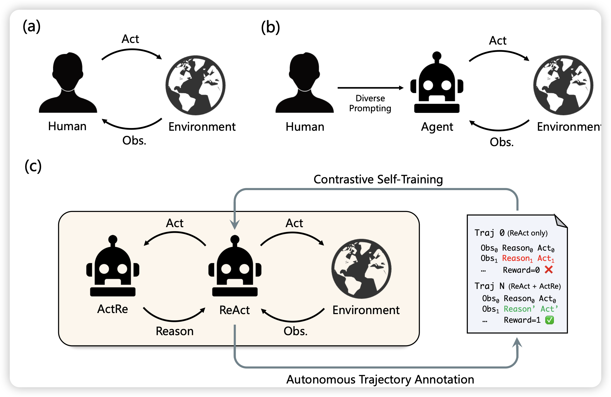
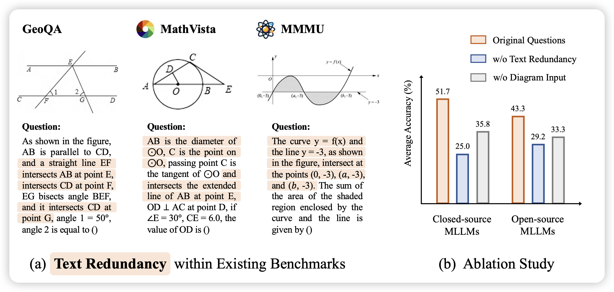
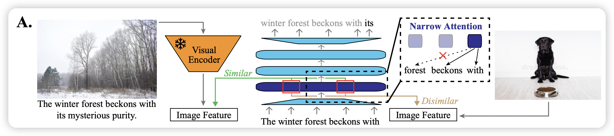

## [ReAct Meets ActRe: Autonomous Annotations of Agent Trajectories for Contrastive Self-Training](https://arxiv.org/pdf/2403.14589.pdf)

刘洋老师的工作，在致敬之前deepmind那个"ReAct meets ReFT"，作者想到了一个神奇办法：如果我找一个后验的模型，可以看到一个action-observation以后，用一个thought来解释为什么会使用这个action，由此生成一条thought-action-obs数据。作者用这个方法随机采样很多了action-trace，然后来反向增强CoT-ReAct模型。在ALFWrold和Webshopping上取得了不错的效果。

## [MATHVERSE: Does Your Multi-modal LLM Truly See the Diagrams in Visual Math Problems?](https://arxiv.org/pdf/2403.14624.pdf)

很多研究发现VLM可以做几何题，但是有一个bias是几何体里面关于vision的信息其实在文本里描述过了(只看text能把原图几乎一样的画出来)。作者发现，把几何题里面的图片去掉只给文本，目前模型的acc甚至还能上涨5个点。

从这个思路出发，作者构建了一个几何题benchmark，有2k题目。每个题目根据文本模态多少的程度，设计了6个模式。作者测了一波目前的vlm，发现基本全炸了

## [Lexicon-Level Contrastive Visual-Grounding Improves Language Modeling](https://arxiv.org/pdf/2403.14551.pdf)

Jacob Andreas的论文，作者认为目前的PLM训练都是在比人类多很多数量级的语料上降ppl，效率很低。这是因为人类的训练是多模态原生的，模态之间能做对比学习。作者类似的模仿这个思路，找了一个(image-text)数据集，用一个锁参的clip encoder计算image embedding。然后用llm在上面训练text的ppl，并且要求前几层的hidden-state可以对齐到image embedding空间去，和别的image embedding做对比学习。发现不仅学习速度快，学习效率也很高

