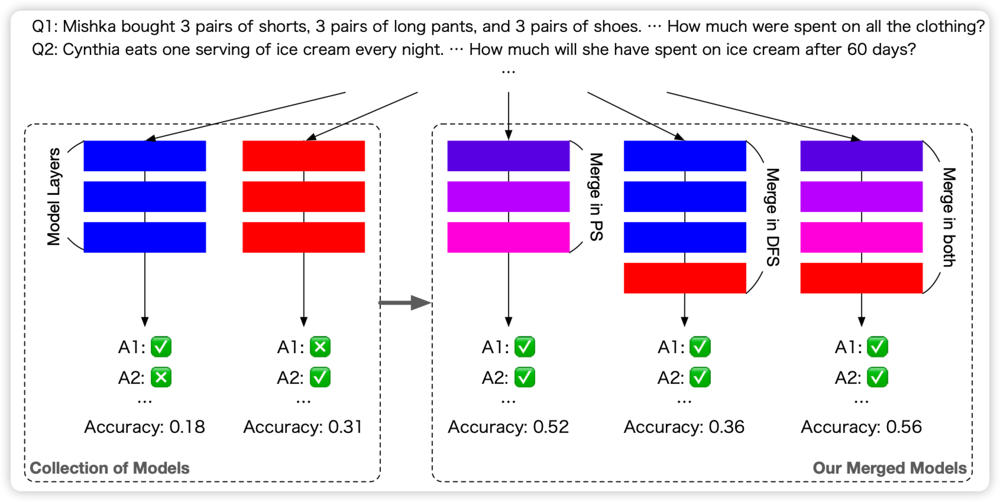
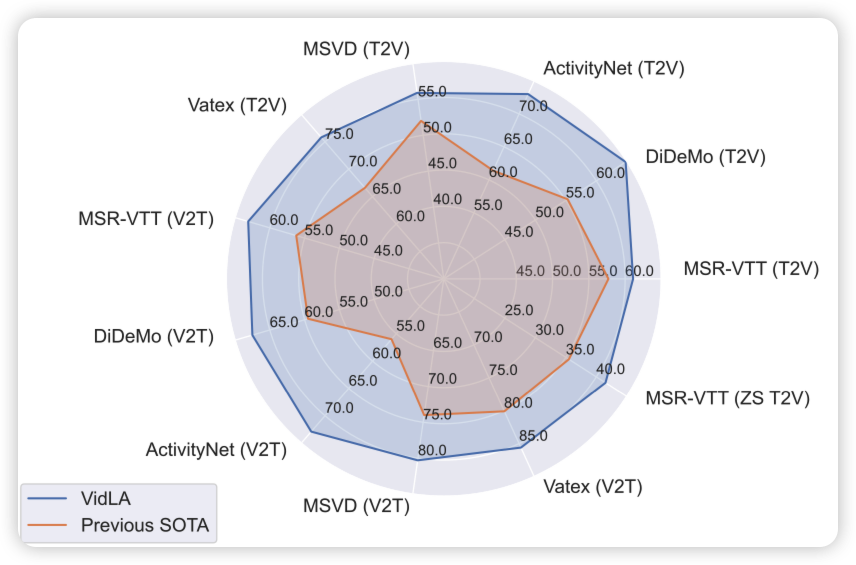

## [Evolutionary Optimization of Model Merging Recipes](https://arxiv.org/pdf/2403.13187.pdf)

transformer作者的新论文。作者提到，目前的model merge是想要把几个模型合并成一个，取得在两个domain都不错的效果。已有方法强烈依赖人类先验，并且效果不佳。作者设计了一套自动搜索的方案，可以把不同模型的不同层拿过来，也可以是同一个层做权重和合并。通过纯自动的方案，甚至可以实现不同模态的模型的合并

> 有点牛，再看一眼

## [VidLA: Video-Language Alignment at Scale](https://arxiv.org/pdf/2403.14870.pdf)

Amazon的工作，作者探索了CLIP那套two-tower encoder编码技术和对比学习在video领域的应用：发现已有的工作在text数据这方面没有对齐不同的粒度。作者在数据方面做了refine,把这个框架scale了起来，最后取得了SOTA的效果

