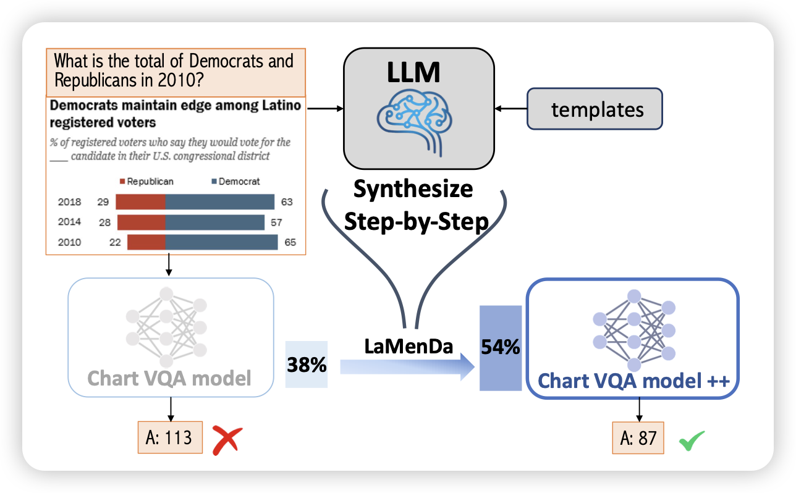

## [Synthesize Step-by-Step: Tools, Templates and LLMs as Data Generators for Reasoning-Based Chart VQA](https://arxiv.org/pdf/2403.16385.pdf)

简单来说，Chart-VQA领域的metamath。作者用LLM构造了大量的subtask-split + program-of-thought类型的数据。由此训练baseline model，把acc从38%提升到了54%。

> 作者似乎没画scaling曲线，不知道如果数据量再增大十倍会怎么样

## [Understanding Emergent Abilities of Language Models from the Loss Perspective](https://arxiv.org/pdf/2403.15796.pdf)

tangjie老师的文章。作者发现，模型所谓的”emergent ability“几乎就是一个pertrain loss的函数，和模型大小、训练规模无关。只需要用pretrain loss，就可以几乎无损地预测出来模型的表现。

由此，可以认为emergent ability是一种loss低于某个阈值的以后的特殊现象，我们其实很难用某个loss区间的结论去评估另一个loss区间模型的性能

> 这么看，真有一种"音障"的感觉了……

## [If CLIP Could Talk: Understanding Vision-Language Model Representations Through Their Preferred Concept Descriptions](https://arxiv.org/pdf/2403.16442.pdf)

很好玩的工作：作者想要思考目前的VLM模型是怎么通过语言模态理解vision concept的，他们设计了两阶段的方法：

1. 训练一个模型去拟合VLM的表示空间，具体来说，用rl算法让一个text模型生成concept的表示，用cosine相似度匹配得分。
2. 训练好了以后，用模型去你拟合各种vision concept的表示，然后观察VLM如何通过文本来描述他对于视觉的感知

作者发现，实际上VLM对于视觉concept的感知并不是视觉的(shape/color)，很多时候都是基于hallicinate的、猜测的结果

