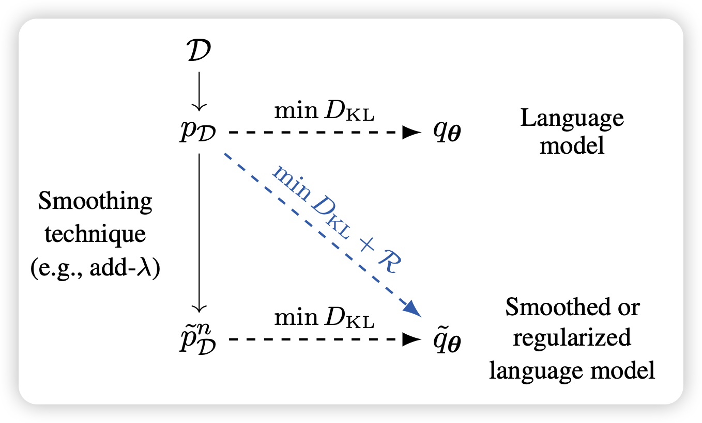
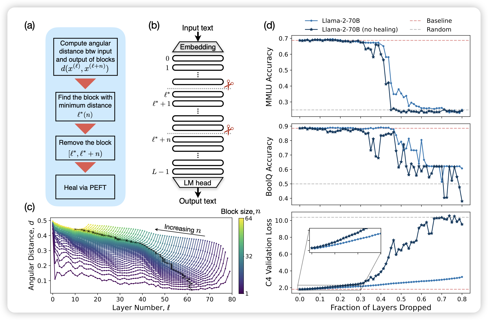

> 最近几天都是NAACL和Coling的论文

## [The Role of n-gram Smoothing in the Age of Neural Networks](https://arxiv.org/pdf/2403.17240.pdf)

ETH的论文：作者认为，在LLM时代后n-gram类的方法似乎已经走进了死路。作者想要探索这些方法在LLM是否仍然有应用价值。他们发现，如果对pretrain corpus用n-gram做平滑，可以训练更好的LLM

## [The Unreasonable Ineffectiveness of the Deeper Layers](https://arxiv.org/pdf/2403.17887.pdf)

Meta的工作：一个不是很新的问题，作者发现在llama里存在大量的无用layer，砍掉一半的layer后模型的效果几乎没影响(右上角)。另外，砍layer可以和lora一起使用。一方面减少一些参数，另一方面增加一些参数。作者认为：

- 要么是目前的训练，尤其是optimizer，没有发挥出deep-model的优势
- 要么是模型的常见模式是在前几层存知识

> 我感觉这俩可能是一件事……因为优化器做不好，模型就只能在前几层存知识？

