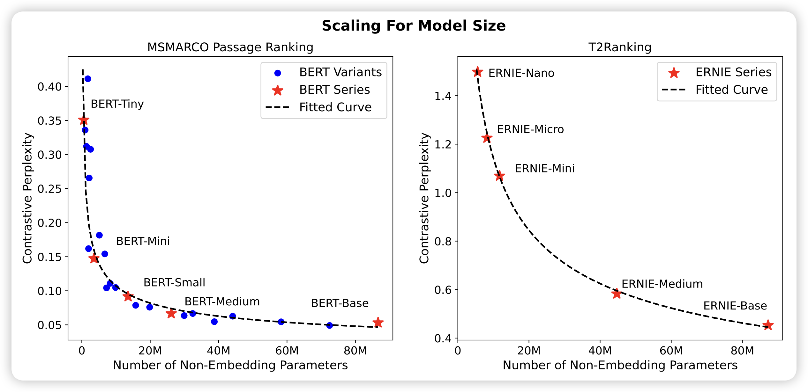

## [Scaling Laws For Dense Retrieval](https://arxiv.org/pdf/2403.18684.pdf)

刘奕群老师的文章：探索了对于dense retrieve任务，也存在scaling law吗？作者用constrastive ppl观察曲线，发现还真是：模型参数增长、训练数据增长都是符合scaling law的。最后，作者探索了在固定budget下如何分配模型参数、训练数据，来取得最好的效果

## [Long-form factuality in large language models](https://arxiv.org/pdf/2403.18802.pdf)

deepmind这两天的推特顶流论文：作者探索了LLM来自动检查文本中有没有事实性错误。首先把repsonse划分成了多个fact，然后逐一去google检查正确性。作者发现，LLM自动检查的方式和人类有70%一致性，对于不一致的情况，有75%的情况下human错了而LLM是对的。

> 而且，LLM标注比human便宜20倍，最起码在这个任务上。

## [Mini-Gemini: Mining the Potential of Multi-modality Vision Language Models](https://arxiv.org/pdf/2403.18814.pdf)

作者发现目前的VLM效果比不上gemini等闭源VLM，作者认为是1.清晰度不够高，2.vision推理数据太少。所以作者加了高清encoder，并且加了reasoning数据，训了2-30B的模型，发现效果很好。

>  这名字取得好，然后模型开源

