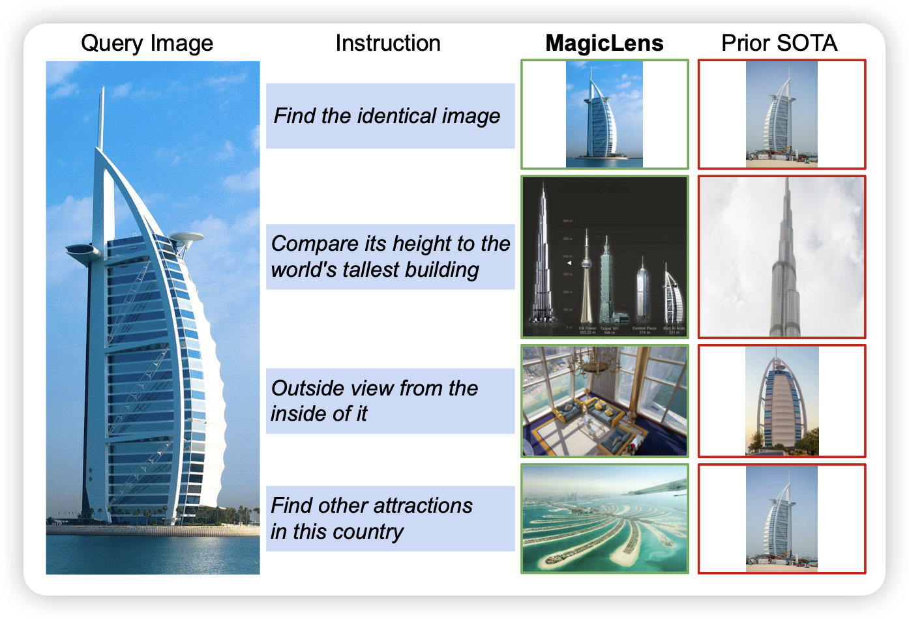
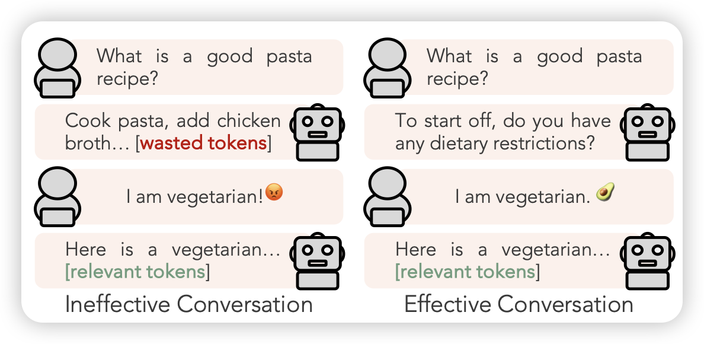
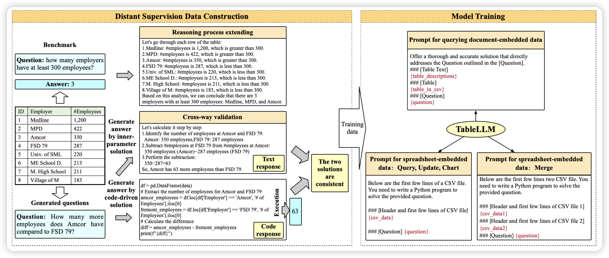

## [MagicLens : Self-Supervised Image Retrieval with Open-Ended Instructions]()

Deepmind的论文：image retrieve任务是输入一个原始image和一个query，寻找一个最符合的目标图片，这个任务目前的效果并不好。作者想了一个很好的归纳偏置：在一个web page里的多个图片天然有一些相关性。作者于是找了一大堆web，抽取了里面所有的图片，然后让另一个LLM生成对饮的(source-query-target)对，在36M数据上训练以后，达到了SOTA水平。关键是，比之前的SOTA，模型小50倍

> 又是很多天才能见到一次的感叹神奇思路的论文

## [STaR-GATE: Teaching Language Models to Ask Clarifying Questions](https://arxiv.org/pdf/2403.19154.pdf)

Goodman的论文：作者发现human来找模型完成任务时往往受到很多unknown preference的影响(比如素食主义者)，模型主动问一些好的问题会有很大的帮助。所以作者设计了一套self-train的框架：

1. 有一个user、一个agent，user有个对agent不可见的偏好描述text
2. 让一个orcale模型看到所有偏好后对问题做出回答oracle-response
3. 让agent用rl的方式问问题，然后user回答。这个问题的reward就是agent可以后面回答出oracle-response的概率

通过这个方法，agent实际需要学会在所有场景下，尽可能问出最重要的问题

> 这个是前几月那个eliciting human preference的后文，很"STaR"的工作

## [TableLLM: Enabling Tabular Data Manipulation by LLMs in Real Office Usage Scenarios](https://arxiv.org/pdf/2403.19318.pdf)

唐杰老师的文章，有点类似之前google那篇论文，也是在csv excel等table任务上标了数据训了模型，作者用NL和program-of-thought分别解决问题，用答案的一致性作为交叉验证，由此可以针对一个问题生成两种trace作为训练数据。

