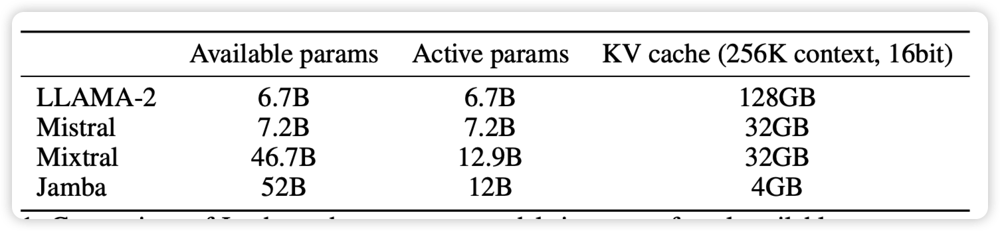
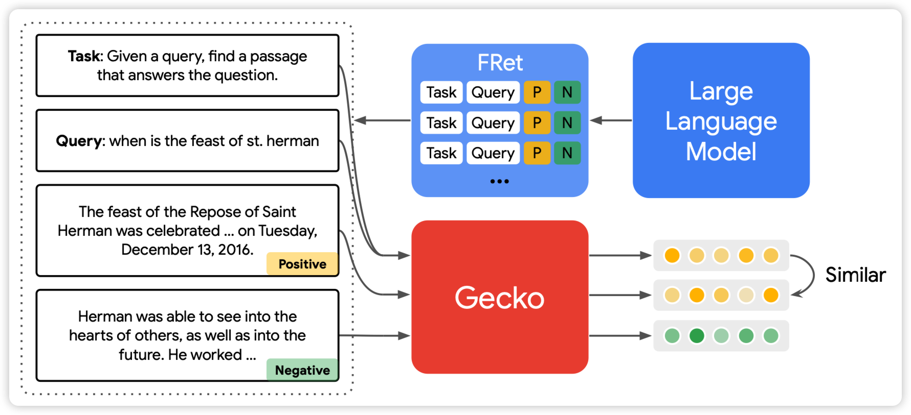
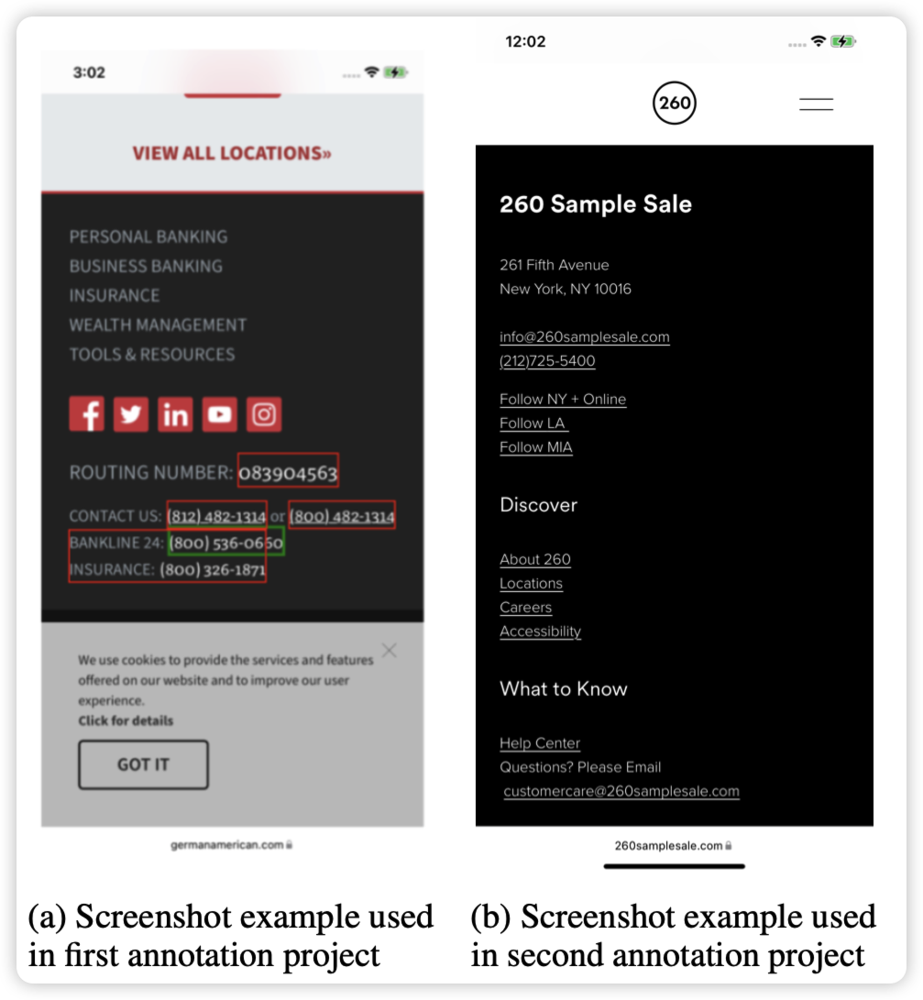

## [Jamba: A Hybrid Transformer-Mamba Language Model](https://arxiv.org/pdf/2403.19887.pdf)

有人帮大家训了开源的MoE大mamba：在普通benchmark和long-text benchmark都是SOTA。同时得益于mamba的高效，他的kv cache很小，然后256k能力随手就来

> 只能说，再看一眼：现在的benchmark score主要取决于SFT数据和测试集的相似度……不知道有没有哪家大公司试试175B的大mamba

## [**Gecko: Versatile Text Embeddings Distilled from Large Language Models**](https://arxiv.org/pdf/2403.20327.pdf)

deepmind的新论文，做dense retreival场景：如果大家还记得几个月前weizhu chen那个花巨多钱用GPT4生成一大堆query-positive-negative达到SOTA的论文。deepmind这篇拓展了这个框架。先让一个大模型生成query-positive，然后用一个已有的dense retreiver找到一大堆passage，然后让之前那个大模型过来一个个看谁是正/负样本，由此进一步提高数据质量。由此，达到了新的sota，甚至256维就能战胜之前的768维的SOTA

> 很有趣的思路，我觉得本质上是把单塔的能力持续地蒸馏到双塔里？

## [ReALM: Reference Resolution As Language Modeling](https://arxiv.org/pdf/2403.20329.pdf)

apple的新论文，apple又发力了？作者发现对于LLM有一个重要的概念：如何引用一个非语言的概念(比如屏幕里的某个物体、操作系统的某个操作)，这对于实际LLM作为人工智能助手非常重要。作者定义了一下这个任务，并且建模为了LLM任务，然后标了数据做了实验，发现效果很不错

> 这算是在致敬realm吗？

