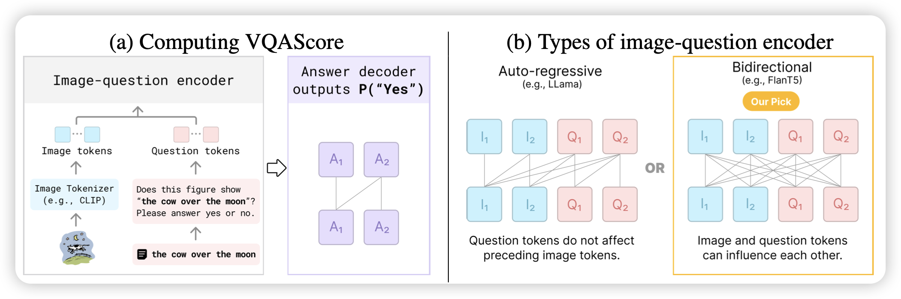
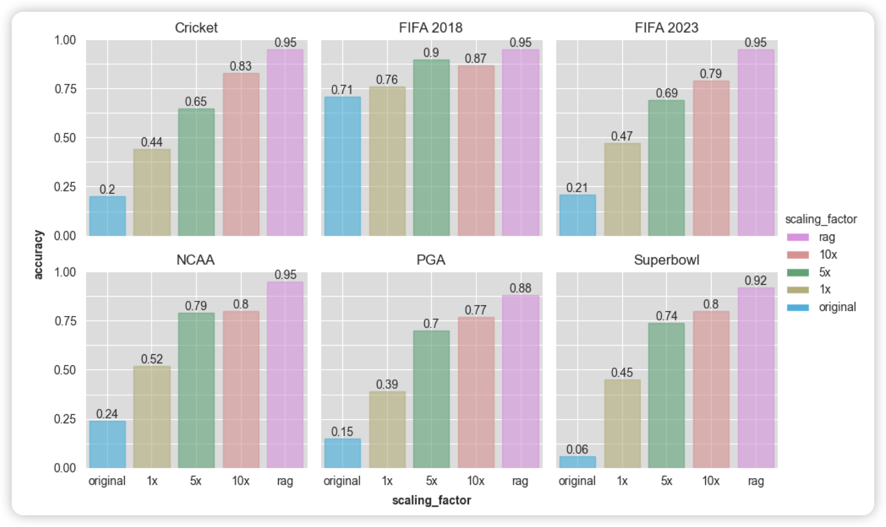
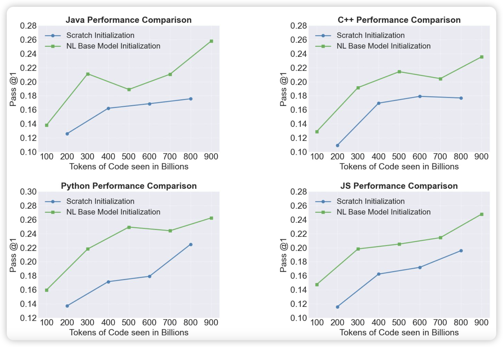

159篇，重量级

## [Evaluating Text-to-Visual Generation with Image-to-Text Generation](https://arxiv.org/pdf/2404.01291.pdf)

Neubig的论文。作者发现目前text2image大家还是再用CLIPscore做评测。CLIPscore效果很差，毕竟是双塔。作者想，现在大家VQA模型都这么好了，能不能用VQA模型的"yes" logits做评测呢？答案是可以，并且效果巨好。

> 感觉就Neubig适合做这个论文……别人提个这种新东西估计没人follow

## [INJECTING NEW KNOWLEDGE INTO LARGE LANGUAGE MODELS VIA SUPERVISED FINE-TUNING](https://arxiv.org/pdf/2404.00213.pdf)

微软的工作，酸了，人家做实验可以finetune GPT4：作者探索了在out-domain场景下，用scaling SFT数据的方式提升模型能力是否可行。作者发现scaling数据量的提升有限，但是scaling fact的提升更高效

## [Stable Code Technical Report](https://arxiv.org/pdf/2404.01226.pdf)

Satbility AI的新code模型。比较"Open"的工作，作者详细讲了训练数据的构造、预处理，然后各种超参数的对比。最后训出来了效果不错的模型，开源了checkpoint。

