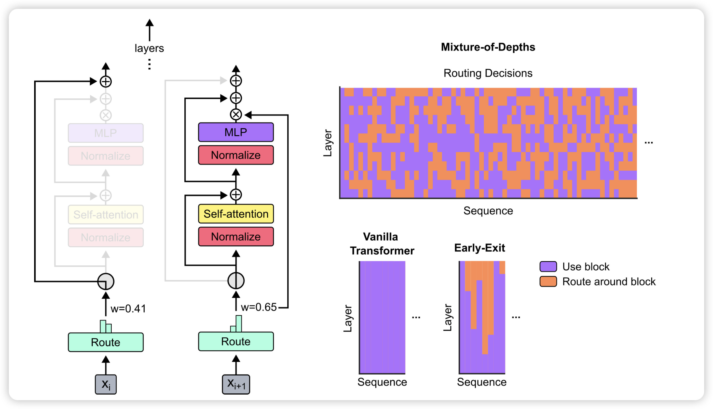

## [Mixture-of-Depths: Dynamically allocating compute in transformer-based language models](https://arxiv.org/pdf/2404.02258.pdf)

昨天的顶流论文：deepmind发现，可以训练一个模型去动态allocate computation。可以每一层增加一个router，决定当前sequence里只有topk的token需要过Attention层，别的token直接走残差连接。作者发现这样训练出来的模型，只需要50%的计算量，就可以和正常模型效果一样好。

> 牛，但是我一直觉得对偶的问题更有意思：现在研究怎么让一些token减少计算量，能不能让模型学着去增加计算量？或者说，在一些token减少计算量时空出来的计算资源，能不能给别的token用去增加计算资源。

