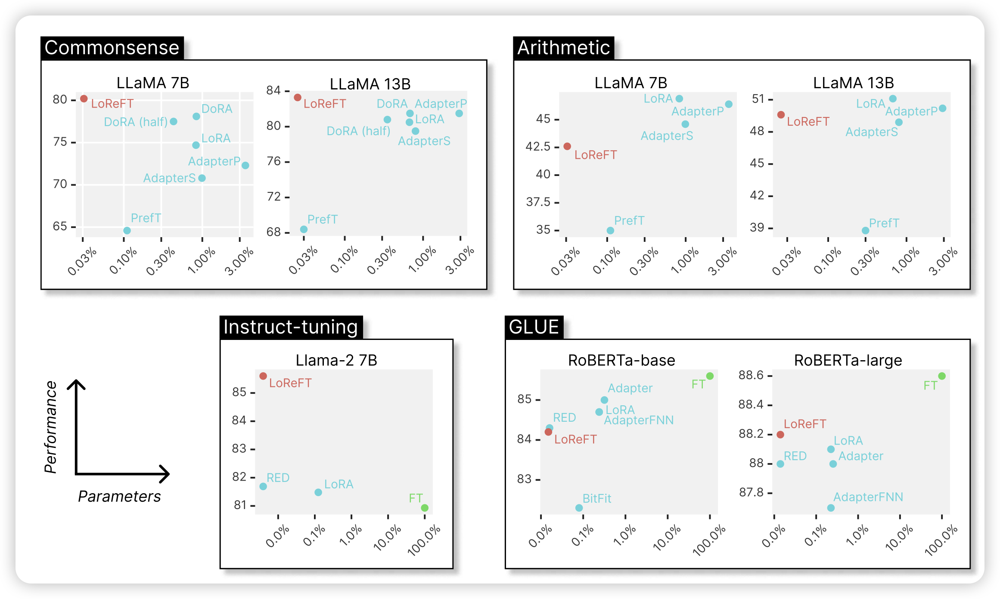
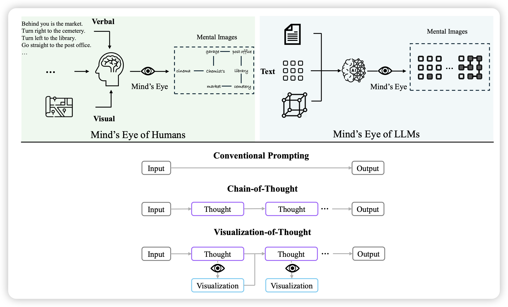
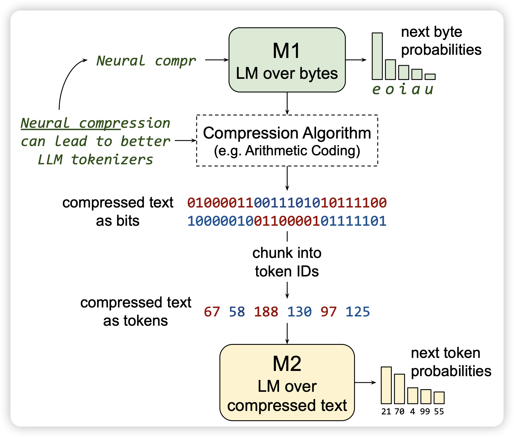
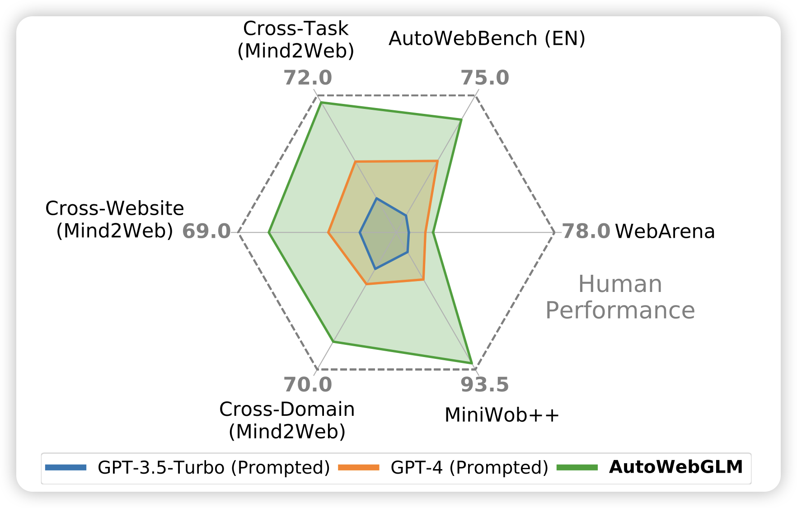

今天全是重量级

## [ReFT: Representation Finetuning for Language Models](https://arxiv.org/pdf/2404.03592.pdf)

这是一篇delta tuning的论文：作者发现LLM中的hidden-state其实表征了巨大的信息，如果只给模型学习一个hidden-state，别的都锁住，比起传统的delta tuning，效果和参数量都好非常多

## [Visualization-of-Thought Elicits Spatial Reasoning in Large Language Models](https://arxiv.org/pdf/2404.03622.pdf)

Furu Wei的论文，作者发现，如果让MLLM在推理的时候可以用上文本和图像的输入，模型的效果会更好，尤其是在空间类任务上

> 名字里这个“elicits spatial reasoning”就很灵性

## [Training LLMs over Neurally Compressed Text](https://arxiv.org/pdf/2404.03626.pdf)

anthropic的论文：作者探索了能不能在已经压缩过的文本上训练Autoregressive-model。如果可行的话，相同的token数量，由于压缩算法的压缩能力远超tokenizer的词表压缩法。这样的模型对应的string更长。也就是说，生成速度更快，可以表征的有效文本更长。

作者发现，这个路线大致可行，效果比不上传统的tokenizer LLM，但是还有优化的空间。

## [AutoWebGLM: Bootstrap And Reinforce A Large Language Model-based Web Navigating Agent](https://arxiv.org/pdf/2404.03648.pdf)

唐杰老师的论文：简单来说，GUI领域的ToolBench。

