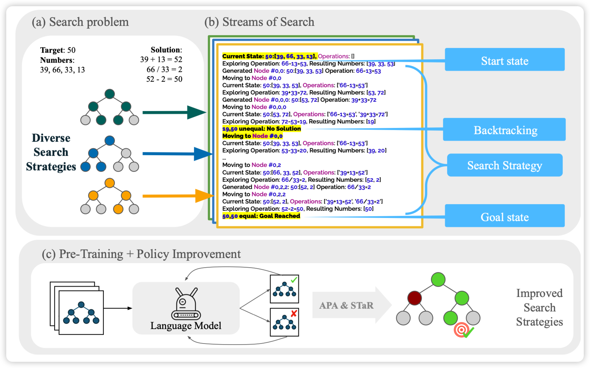
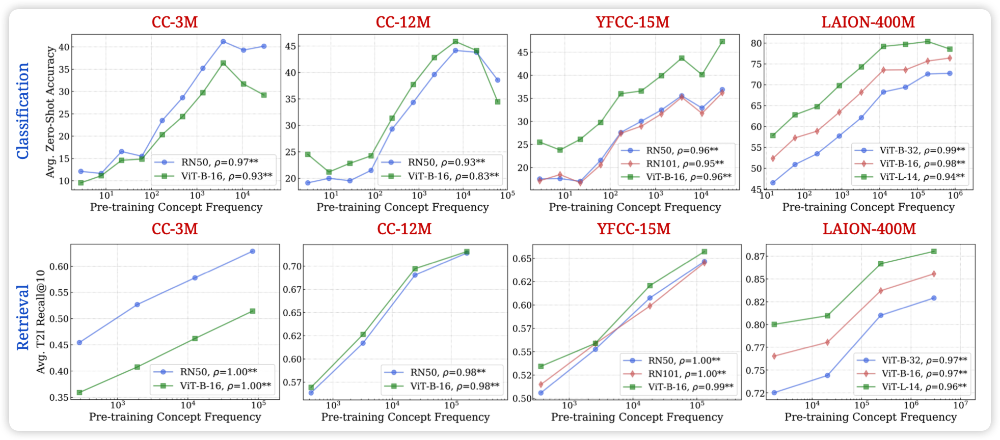
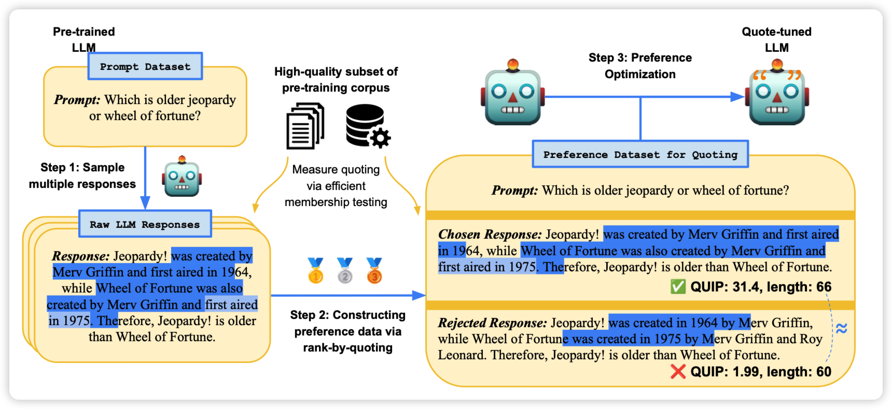

## [Stream of Search (SoS): Learning to Search in Language](https://arxiv.org/pdf/2404.03683.pdf)

Goodman的论文，对ToT猛猛发力。作者发现目前的LLM做ToT类的东西效果不好，作者标了一些数据，包含多种search算法，让模型做search去解决24点(其实是拓展形式，xx点都有可能)。然后SFT之后跟了一个STaR的self-train环节，发现效果还能再涨。

> 之前还真没咋看到training ToT的文章……

## [No “Zero-Shot” Without Exponential Data: Pretraining Concept Frequency Determines Multimodal Model Performance](https://arxiv.org/pdf/2404.04125.pdf)

随着LLM的发展，大家发现"LLM展现出了zero-shot的能力"。作者质疑这个说法：所谓的"zero-shot"，是真的在pretrain dataset中"zeroshot"吗？

作者找到了一些所谓的zeroshot的concept，划分了每条数据属于哪些concept，然后测试了各家开放trainset的MLLM的数据集中每个concept的出现次数。发现"zeroshot" performance和训练集中concept出现次数成基本完美的scaling law。甚至，如果按照concept的语义相似度对别的concept加权， 还是完美符合scaling law……

> 这题目不够搞，要是我就取名：zero-shot? $e^n$-shot is all you need!

## [Verifiable by Design: Aligning Language Models to Quote from Pre-Training Data](https://arxiv.org/pdf/2404.03862.pdf)

作者提到， LLM生成的内容，往往需要验证是否来源于可信的训练数据。然而这个验证很困难，作者想了一个怪招：让模型生成和训练数据尽可能符合的n-gram。预设模型生成的和某条数据一致的n-gram就是在"引用"某个训练数据。由此获得了一个三步的方案：

1. 让模型对query生成多个response
2. 每个response根据n-gram计算得分，和越多的训练数据n-gram一致，得分就越高
3. 得到pairwise data做对齐训练

作者发现，这样训练完以后的模型神奇的出现了分布外的quote引用能力

