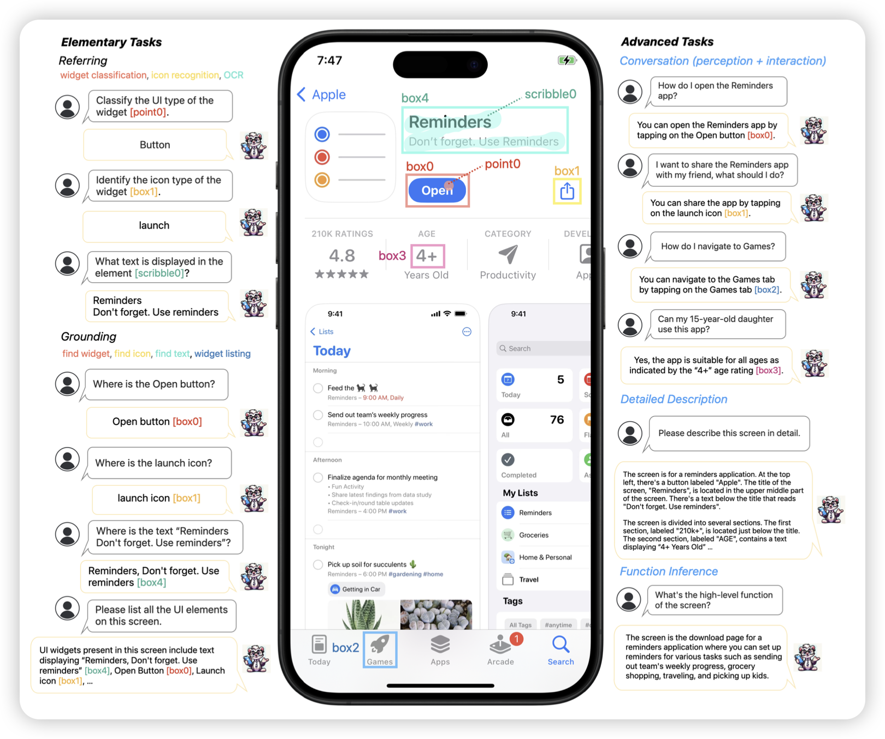
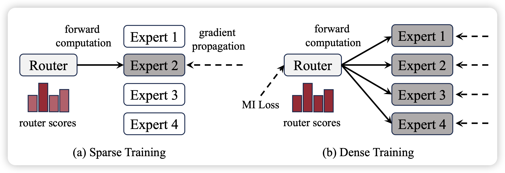
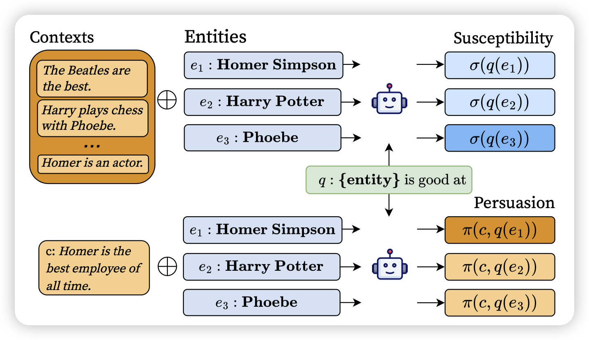

最近我在筹划一篇笔记，大致内容是 CogAgent、AutoWebGLM、Ferret-UI，估计这周的某一天写完吧。还有两个备选：

1. Retro、Realm、KNN-LM，讲讲RAG
2. Switch-Transformer、deepseek-MoE、MoE-mamba、topp-MoE，讲讲MoE

不知道大家觉得哪个好

## [Ferret-UI: Grounded Mobile UI Understanding with Multimodal LLMs](https://arxiv.org/pdf/2404.05719.pdf)

既MM1之后，apple继续发力。这次是GUI-Agent。作者训练了一个VLM模型，可以操作手机。把一大堆ui-related任务整合成了sft的形式，然后训到了一个模型里，效果超过了GPT-4v

> 期待WWDC

## [**Dense Training, Sparse Inference: Rethinking Training of Mixture-of-Experts Language Models**](https://arxiv.org/pdf/2404.05567.pdf)

作者发现，MoE训练的时候也是激活router然后选择前topk，这样训练其实并不高效，因为所有的expert参数仍然是需要加载的。能不能训练的时候取topk里的k是无穷，然后预测的时候再使用topk=2。作者发现这样训练是非常参数高效的，关键是，效果还很好

> 只能说，确实

## [Context versus Prior Knowledge in Language Models](https://arxiv.org/pdf/2404.04633.pdf)

在模型的预测中，既会参考参数内的知识，也会参考context中给定的info。作者探索了，能不能更确切的测量出模型到底在参考parameteric knowledge还是context knowledge? 作者设计了基于matual information的计算指标 susceptibility和persuasion，可以更好地探测模型生成过程中的依赖性。

> 这篇和昨天那篇"quote"研究的东西有点像，我觉得以后的模型最好可以对于生成的每一句话都有理可依，说出来是参考了训练数据中的xxx，还是context中的yyy。
>
> 这样别人用模型的时候也放心……最起码可以看看是不是hallicination

