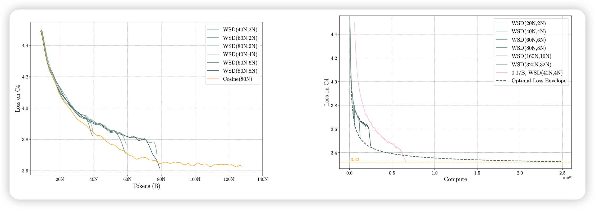
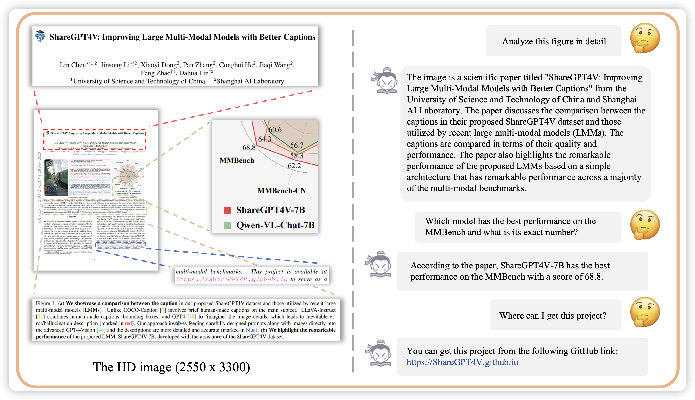

## [MiniCPM: Unveiling the Potential of Small Language Models with Scalable Training Strategies](https://arxiv.org/pdf/2404.06395.pdf)

推荐组里的工作minicpm。作者在2B小模型上开展了一系列实验，用loss prediction技术找到了最好的训练方式。设计了一套新的学习率衰减方法，可以比之前的方法效果更好。

> 今年的NLP课就用的这个模型……

## [InternLM-XComposer2-4KHD: A Pioneering Large Vision-Language Model Handling Resolutions from 336 Pixels to 4K HD](https://arxiv.org/pdf/2404.06512.pdf)

4k的VLM，列文虎克都没他清楚。作者发现，把分辨率提上去，模型的能力大大增强，在benchmark上一度击败GPT-4v和Gemini

