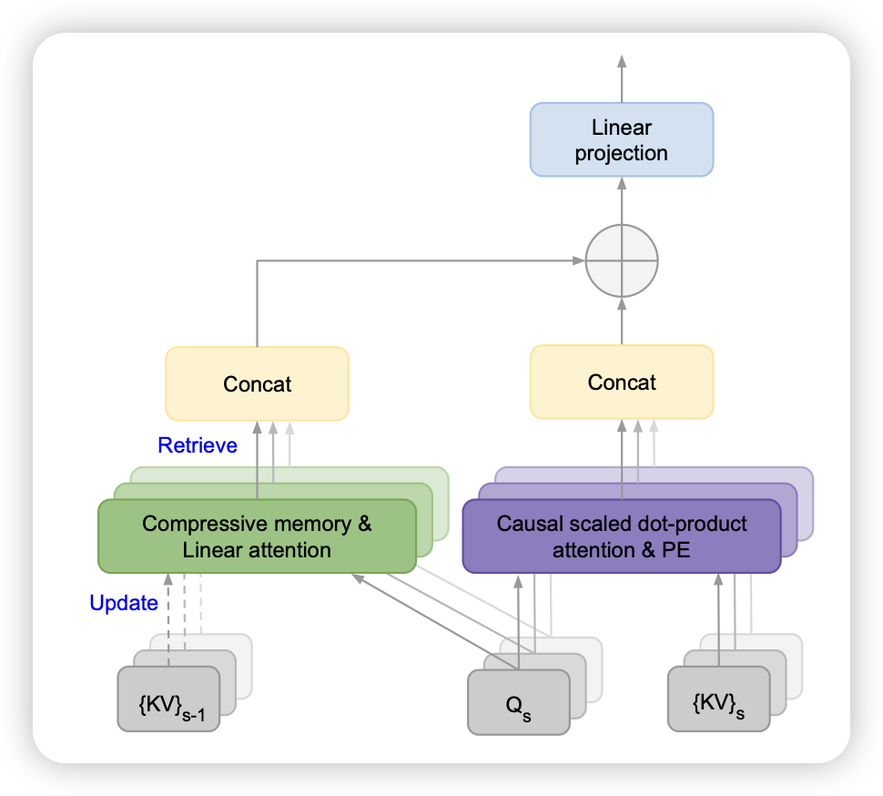

## [Leave No Context Behind: Efficient Infinite Context Transformers with Infini-attention](https://arxiv.org/pdf/2404.07143.pdf)

google的论文，有点少见，现在不都是叫google deepmind了吗？虽然作者讲了infini Attention的故事，但是在实现上看起来很像Memory transformer那一套，作者把Attention计算时分为了window内的scaled dot-product部分和Window外的retreive部分。效果还不错

> 看到这个我突然想到，如果我前面的window外是整个预训练语料，这个算不算“encoder可调参的RAG”呢？🤔

