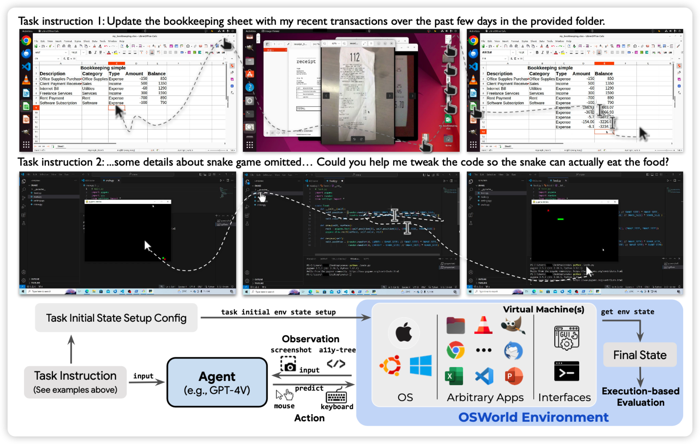
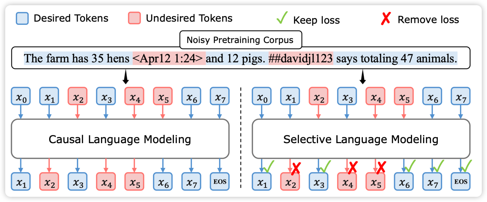

## [OSWORLD: Benchmarking Multimodal Agents for Open-Ended Tasks in Real Computer Environments](https://arxiv.org/pdf/2404.07972.pdf)

Tao Yu老师的工作：作者在windows/mac os/ubuntu几个系统上搭建了模拟环境，可以进行各种操作。然后定义了一个含有369 task的数据集，发现目前的Agent在这些任务上非常差。

> 经典的benchmark类型的论文……下一篇工作就是标10万条数据，发现在in domain做的和4v一样好……再下一篇是rl+self-train以后out-domain效果也不错

## [Best Practices and Lessons Learned on Synthetic Data for Language Models](https://arxiv.org/pdf/2404.07503.pdf)

deepmind的综述性文章：作者归纳了近期所有training on synthetic data类型的论文，分析了一些insight和趋势，并且给出了他们自己在这个方向上的经验。

## [RHO-1: Not All Tokens Are What You Need](https://arxiv.org/pdf/2404.07965.pdf)

Weizhu Chen的论文，作者发现训练语料里的很多token是完全的噪声，对训练只会取得负面的影响。所有一个直觉就是：找到“噪声token”不去计算loss会不会更好呢？

1. 作者找到了一个高质量语料，认为里面全是"token"
2. 然后训练一个模型去分类哪些token是好token和坏token。

3. 接下来把continue pretrain语料里做一个分类，坏token不计算loss

作者发现这样训了2Btoken以后，和之前deepseek math的500Btoken效果一样。7B模型MATH acc 50%。

> 一个7B GSM8K 80%，一个7B MATH 50%，仿佛变成什么凭证了吗……好像是黄老师那个ToRA先起的头

