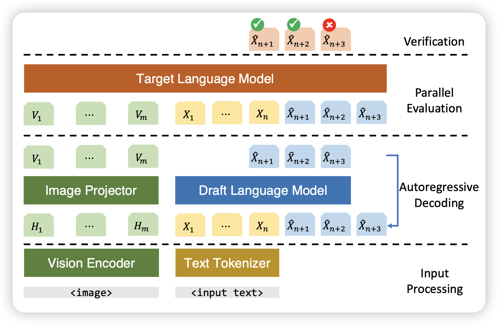
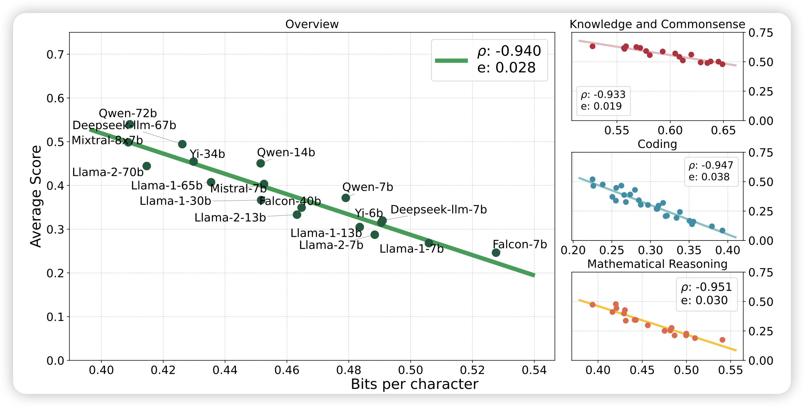

这周二还好，不到200篇

## [On Speculative Decoding for Multimodal Large Language Models](https://arxiv.org/pdf/2404.08856.pdf)

作者探索了在MLLM上(LLaVA)使用投机推理，发现神奇的现象：用一个language-only小模型作为draft model竟然效果不错..?

> 所以现在的MLLM其实是LLM，或者说测试的MLLM任务实际上是 language-info-complete的

## [**Compression Represents Intelligence Linearly**](https://arxiv.org/pdf/2404.09937.pdf)

大家都看过那个很火的[compression for AGI](https://www.youtube.com/watch?v=dO4TPJkeaaU&t=1851s)的视频，但是似乎很少人做过实验。在这里作者真的做了实验，把bpb指标作为横坐标，把downstream performance作为纵坐标测试了各家模型，发现确实如此：压缩率和模型表现几乎是维持线性在增长。

> 有一种骗引用的感觉：想在论文里引用compresson for AGI的地方就引用这篇……其实这个的结论在前几天唐杰老师那个loss for emergent ability里面做过一次了

