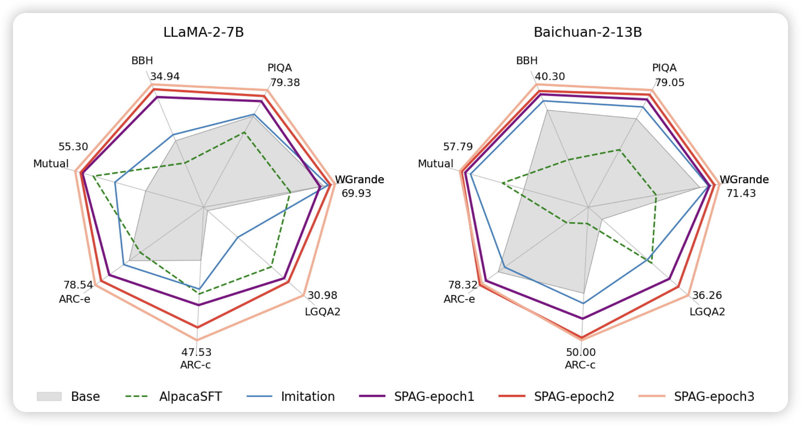

## [Self-playing Adversarial Language Game Enhances LLM Reasoning](https://arxiv.org/pdf/2404.10642.pdf)

腾讯出的一个有趣的论文，作者发现了一个文字博弈游戏taboo：防守方知道一个单词，只要说出来这个单词就输；攻击方猜测这个单词是什么。然后两个人正常对话看能不能保守秘密。作者发现，在这个任务上做reasoning self-train训练的模型，竟然在其他几个reasoning benchmark上指标涨上去了。

> 这算什么……很scalable的任务吗

