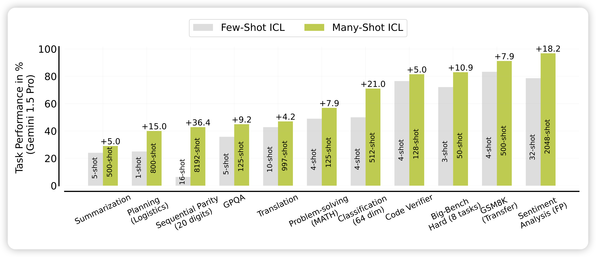
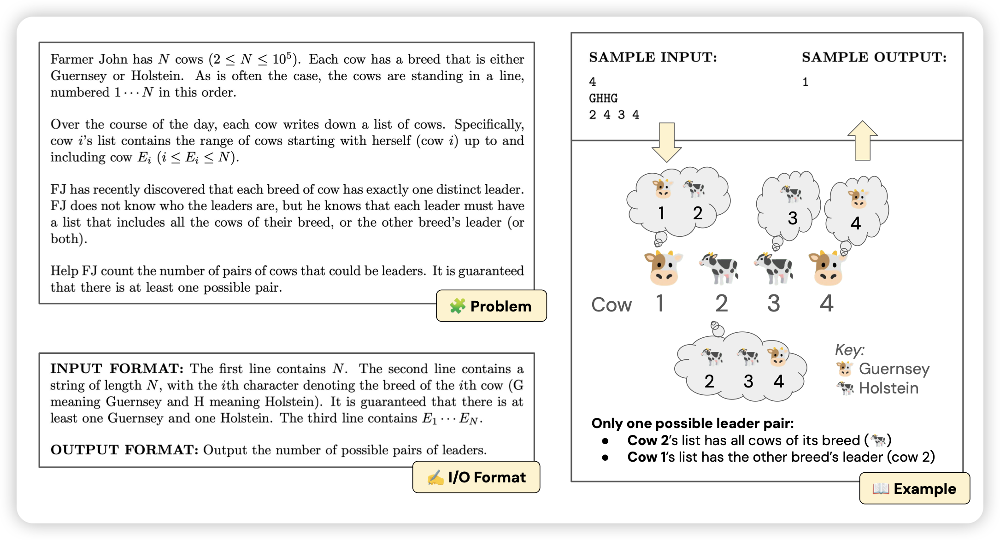
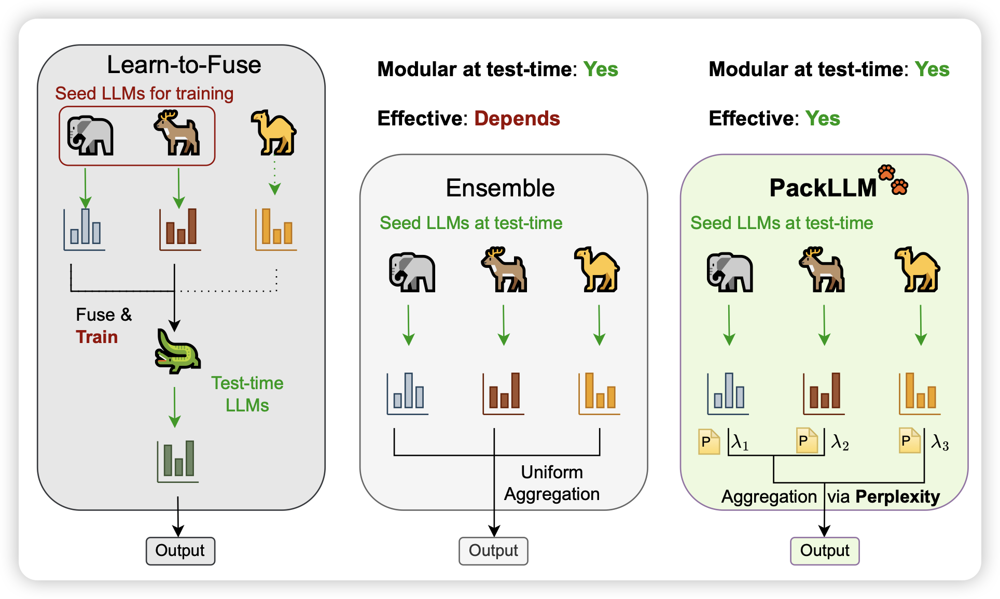

## [Many-Shot In-Context Learning](https://arxiv.org/pdf/2404.11018.pdf)

deepmind的论文，起名字还得是他们。作者认为既然目前模型的sequence length越来越长，测试的时候为什么还非得是5-shot、3-shot呢？作者直接尝试了所谓的many-shot场景，发现效果提升很明显。然而，在这个场景下的瓶颈是实际上是shot对应的human generate数据不足，于是作者尝试了让模型自己生成many-shot中对应的数据，发现效果也不差。

> 挺有趣的工作，这算是给gemini那个report洗白吗……

## [Can Language Models Solve Olympiad Programming?](https://arxiv.org/pdf/2404.10952.pdf)

Shunyu Yao的新论文，构建了一个包含307道oi题的benchmark，发现GPT4只能解决7%。经过各种prompt Agent框架后，也只有20%。另外作者发现通过一些简单的hint，可以解决大部分之前解决不了的题目，揭示了还有很大的提升空间。

> 怎么感觉从SWEbench开始，shunyu yao总在研究benchmark。这是某种神奇的科研shortcut吗……

## [Pack of LLMs: Model Fusion at Test-Time via Perplexity Optimization](https://arxiv.org/pdf/2404.11531.pdf)

作者研究了一个挺好玩的东西：由于不同模型的知识都不太一样，能不能在解码时根据query来动态融合不同模型的知识和能力呢？作者设计了一套基于ppl的方法，对ppl低的模型赋予更高的权重，这样可以考虑到不同模型对于目标语料的熟悉程度。发现效果不错

