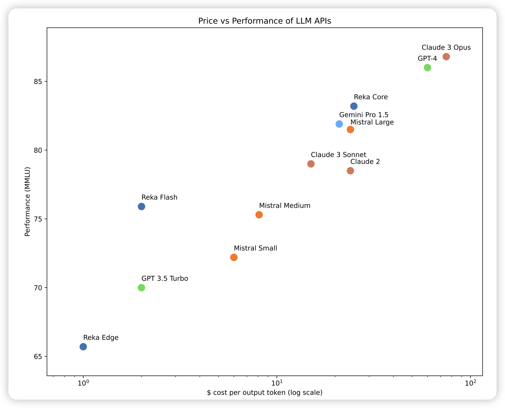

## [**Reka Core, Flash, and Edge: A Series of Powerful Multimodal Language Models**](https://arxiv.org/pdf/2404.12387.pdf)

Yi Tay出走一年，模型终于训出来了。是三个型号的dense模型，原生支持text\image\video多模态，有长文本版本，效果也不错。

> 不如llama3，人家开源

