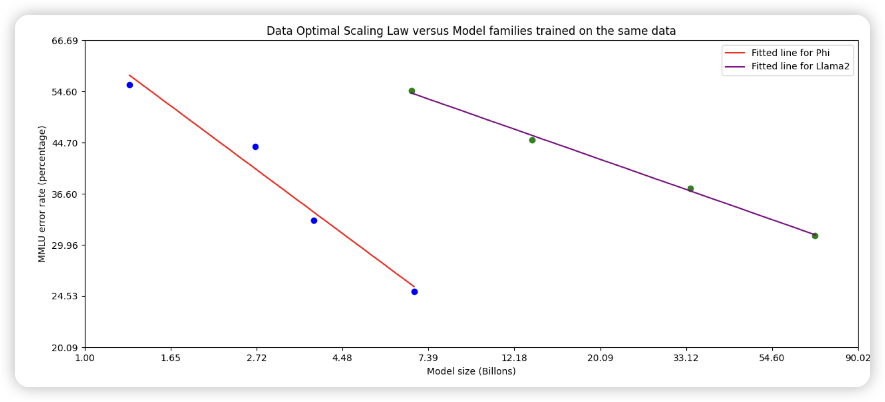
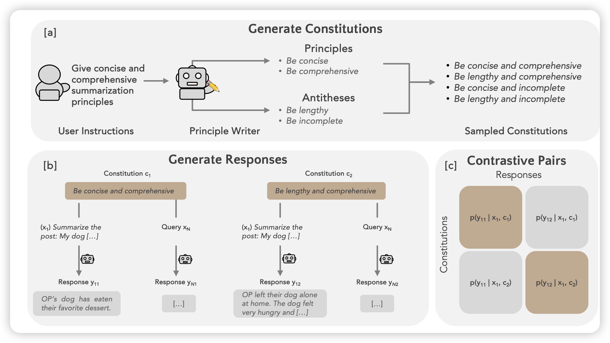
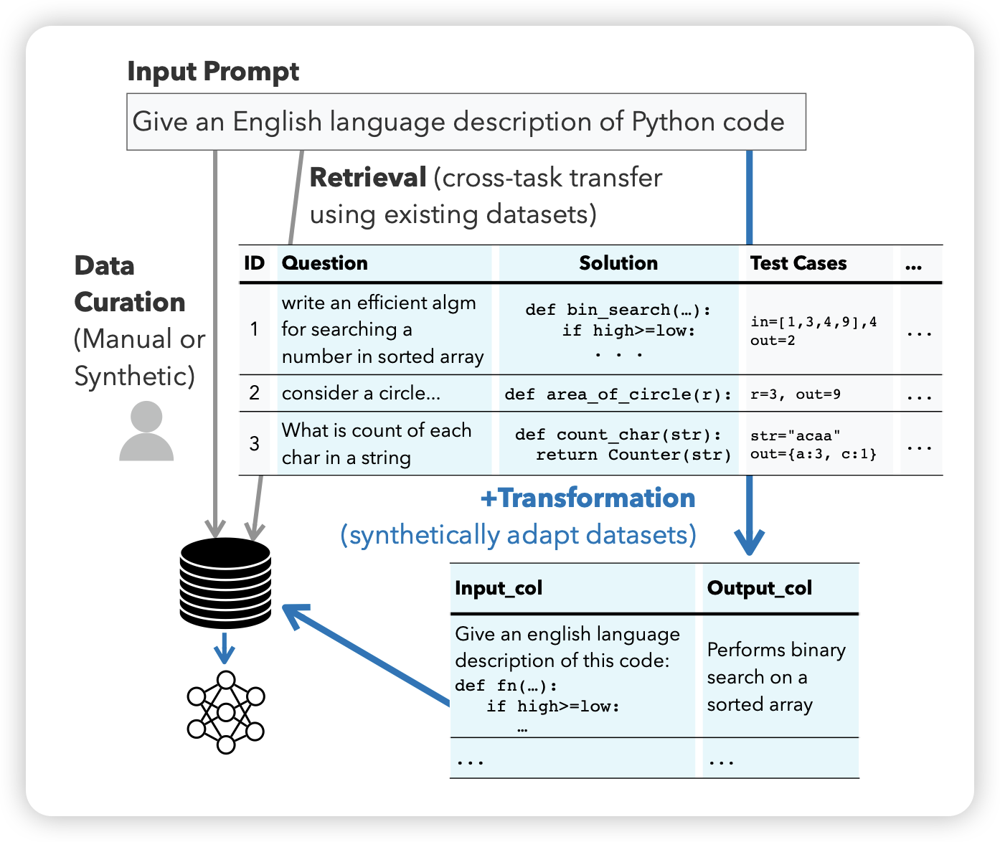
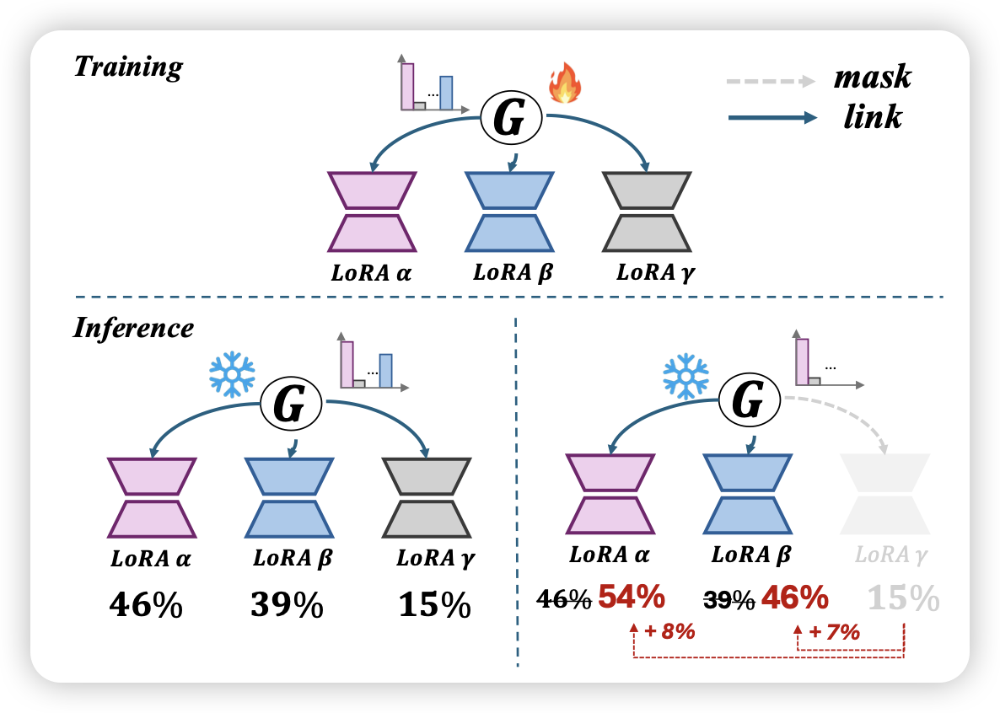

这周虽然周二，但论文却不是很多，感觉准备憋个大的

## [Phi-3 Technical Report: A Highly Capable Language Model Locally on Your Phone](https://arxiv.org/pdf/2404.14219.pdf)

刷榜第一人phi-3来了。3B模型，训了3T Token，由于高质量数据和合成数据，效果接近Mixtral 8x7B。另外作者还尝试了更大号的，发现效果更好

> 我一直感觉phi团队是不是在往外抖落OpenAI机密……

## [Self-Supervised Alignment with Mutual Information Learning to Follow Principles without Preference Labels](https://arxiv.org/pdf/2404.14313.pdf)

Goodman的论文，是RLHF领域的，最近挺少推这个方向的论文了。不过这篇思路挺有意思的。思路有点像之前港大的一篇self evolve的工作：输入一个query以后，先让模型生成这个query的一些可能要求作为constitution，以及生成一个response。然后让模型测试这个response是否满足要求。$P(response|query, constitution)$作为feedback，由此来对齐模型

> 这个事情和LeCun之前那个model as both rewarder/generator有点像。其实是把model-as-rewarder的能力蒸馏到model-as-generator里面了？

## [Better Synthetic Data by Retrieving and Transforming Existing Datasets](https://arxiv.org/pdf/2404.14361.pdf)

牛逼哥的新作，他是经典作者少。作者发现，目前的研究主要是数据瓶颈，大家都使用合成数据，但是合成出来的数据往往质量低、diversity、复杂度不够。所以，另一个路线是把已有数据做转化。作者想到：能不能根据我想要的数据格式自动转换数据呢？

作者设计了retrieve的框架，根据target task从一大堆已有的SFT数据里自动寻找最像的instance，然后转化对应的数据到target task format。发现这张做出来的合成数据质量就会很高

> 很聪明的想法

## [Mixture of Lora Experts](https://arxiv.org/pdf/2404.13628.pdf)

猜猜是谁起的名字，起名仙人好像就那么几位……我不太懂lora这个领域，我理解作者的意思是，训练时搞出来多个不同的moe lora，然后测试时可以根据router的结果动态的把几个lora的权重缝合在一起变成一个ensembled lora再跑前向，这样计算量不会增加多少，但是效果不错。

