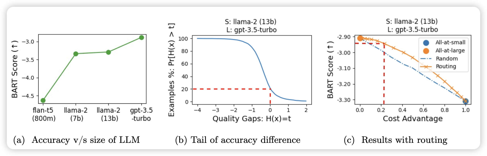

## [Hybrid LLM: Cost-Efficient and Quality-Aware Query Routing](https://arxiv.org/pdf/2404.14618.pdf)

microsoft的老文章，今天挂出来：作者的思路很简单，query本身有简单有困难，对于很简单的问题其实不需要LLM，只需要small language model。能不能训练一个router，可以根据query和预期的回答质量选择llm呢？作者发现可以，并且效果还不错

> 这个领域感觉还挺有意思的，不知道后面有人没有更系统地做过实验。我感觉router起到的作用实际上是预测模型的知识边界？

