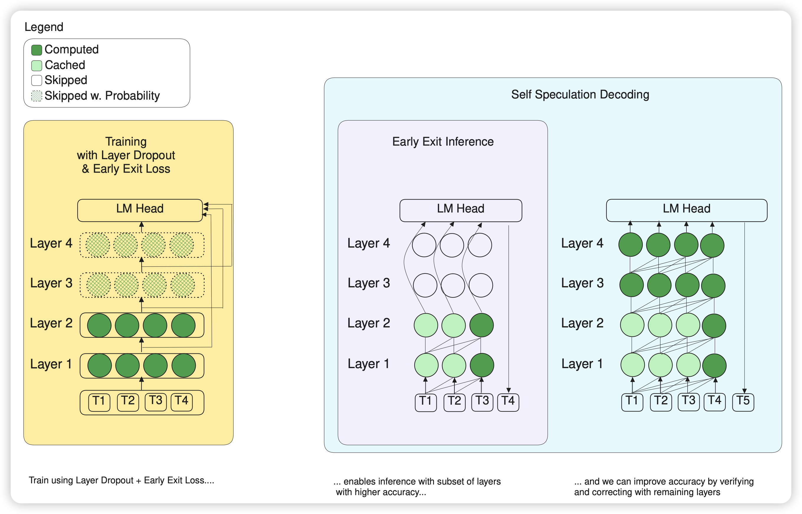

今天的论文感觉全是那种标题贼牛的

## [LayerSkip: Enabling Early Exit Inference and Self-Speculative Decoding](https://arxiv.org/pdf/2404.16710)

meta的论文，不同于之前那个顶流MoD，这篇考虑的是某些token可以跑了几个transformer block以后直接就给出了next-token的预测。另一方面，作者还搞了一个有意思的，可以让已经被跳过的layer作为draft model去检查skip是否是有效的。

