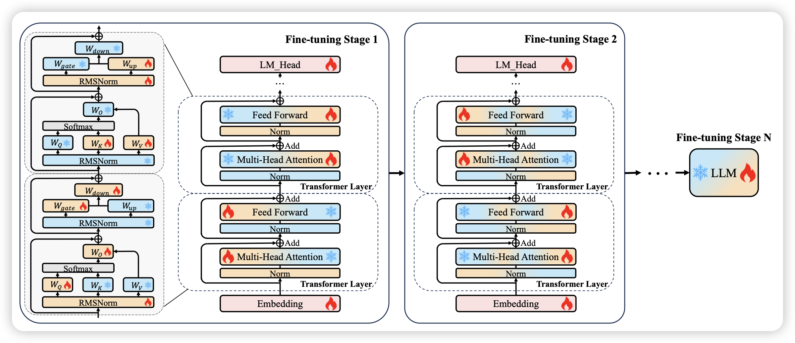
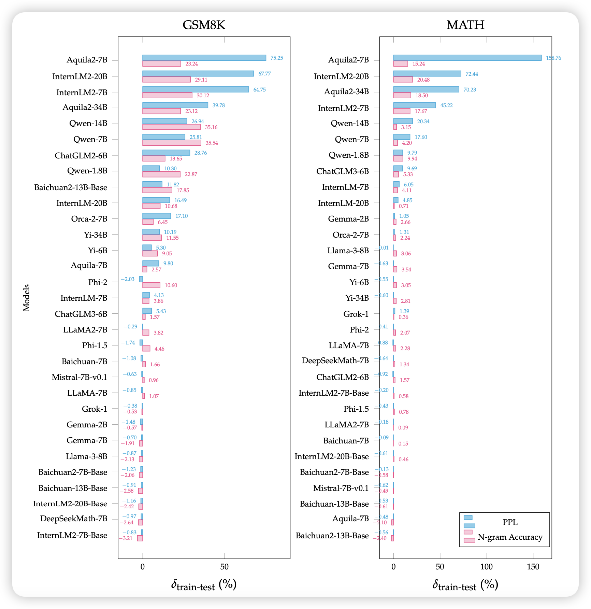
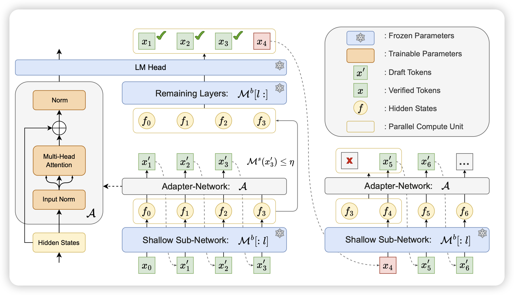

不如GPT2-chatbot

## [HFT: Half Fine-Tuning for Large Language Models](https://arxiv.org/pdf/2404.18466)

作者认为Finetune中的灾难性遗忘问题是因为参数更新太大了，那么直觉的想法就是：如果我只更新一部分参数，会减少这个问题吗？

这里作者尝试了两阶段的训练，一阶段更新一半的参数，发现效果不错。

> 有点神奇，想起之前推过的一篇很像的论文：当时是先全参数finetune，找到变得最多的一部分参数，第二轮只训这一部分。

## [**Benchmarking Benchmark Leakage in Large Language Models**](https://arxiv.org/pdf/2404.18824)

pengfei的论文，作者用ppl和n-gram的方式检测了已有的模型对于数据集的train set甚至test set是否见过。类似于之前skywork那个论文里提到的方法。

> 作者专门写了"training on benchmark data does not imply cheating"，求生欲极强……

## [Kangaroo: Lossless Self-Speculative Decoding via Double Early Exiting](https://arxiv.org/pdf/2404.18911)

华为的论文，怎么感觉华为一直在研究投机推理……我也没太看懂，看起来作者想要解决投机推理中draft model的问题，类似于之前的medusa，想要让大模型通过early exit做draft model，然后再去验证。这带来的问题就是draft model其实也挺慢的，作者就又加了一些优化。最终效果比之前medusa更好

