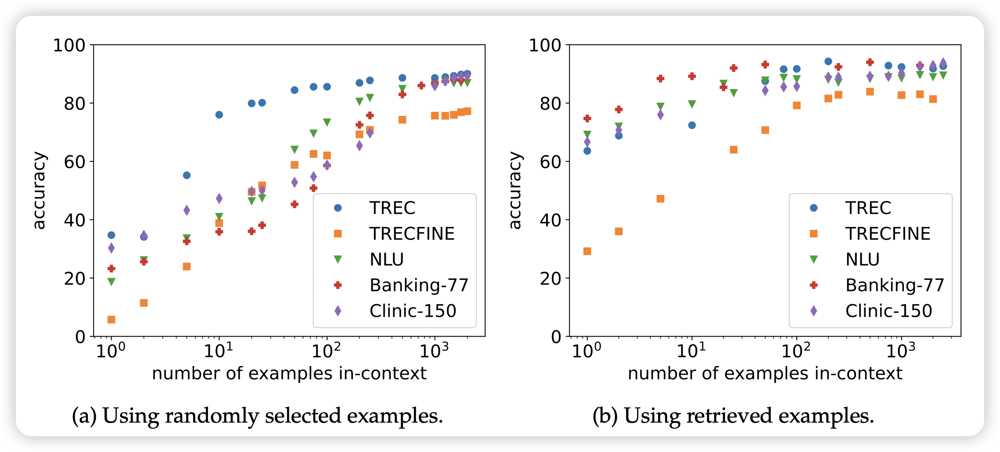
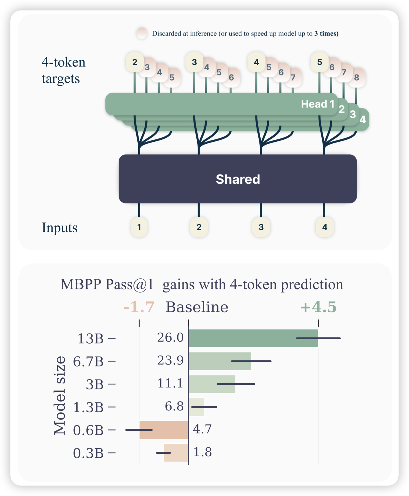

失算了，没想到五一也在更新

## [In-Context Learning with Long-Context Models: An In-Depth Exploration](https://arxiv.org/pdf/2405.00200)

neubig的论文，被上周的manyshot icl抢发了。类似的思路：目前的模型已经是sequence length 128k了，能不能来一个1024-shot learning?作者发现：

1. sample数量增长，模型效果增长
2. 对比finetune，这个方法不够data-hungry，但是相对更鲁棒
3. 经过一系列实验，发现效果增长不是来源于学会了task，而是找到了类似的example

> emm……我觉得finetune也"不是来源于学会了task，而是找到了类似的example"

## [Better & Faster Large Language Models via Multi-token Prediction](https://arxiv.org/pdf/2404.19737)

Meta的论文，作者发现目前的GPT系列都是next-token-prediction，每次预测下一个Token的logits。作者在想，如果一次预测未来n个Token，速度会加速吗？所以作者把模型结构改成了，前面是share的部分，从某个部分开始变成了n份，分别预测未来的n个token。发现这样训出来的模型当参数量起来以后，效果并不差，同时速度非常快。

> Llama时代下的，non-autoregressive model..?

