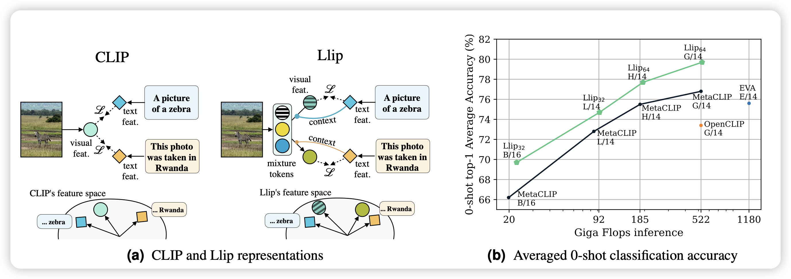
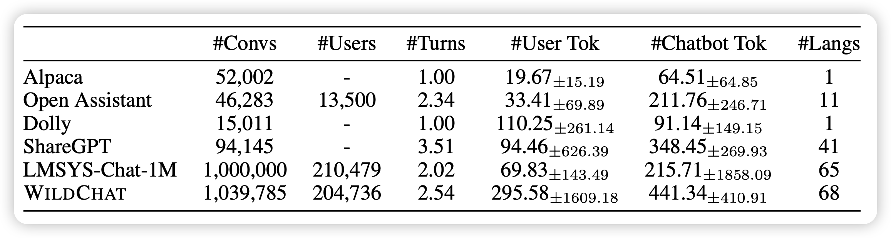

最近读论文的速度怎么比几个月前显著下降了，不行，接下来一个月必读50篇！

## [**Modeling Caption Diversity in Contrastive Vision-Language Pretraining**](https://arxiv.org/pdf/2405.00740)

meta的工作，很好玩的思路：大家都知道clip是把图片文本对通过instance-level的对比学习来建模，vision-encoder和text-encoder是完全独立的。作者发现，对于不匹配的图像文本对，也许某些局部或者说concept是匹配的，clip loss会带来误判。于是作者找到了另外一个方案，把一个image变成多个vector，然后每个token分开算loss。希望在caption内部的每个token和图片embedding的每个位置对应是正样本。由此可以建模出不同的concept。作者发现这种方案比传统clip效果好很多

> 有点神奇，这个更像是把image embedding做了个bag-of-word假设？

## [**WildChat: 1M ChatGPT Interaction Logs in the Wild**](https://arxiv.org/pdf/2405.01470)

有点顶级：作者通过给用户免费用ChatGPT的方式，收集到了1M的用户和ChatGPT的对话记录，这个数据集没做任何处理，所以包含了一些toxic的内容。

> 这算不算花钱买论文？话说我挺好奇这样收集的用户case会不会比self-instruct生出来的1M query diverse很多

