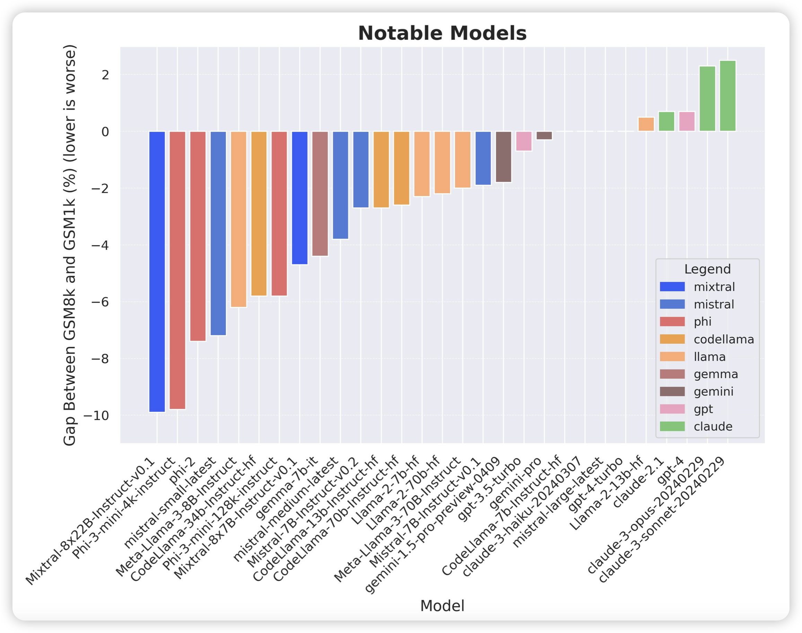

2号和3号的论文好像串了，就把2号的放在3号里了

## [A Careful Examination of Large Language Model Performance on Grade School Arithmetic](https://arxiv.org/pdf/2405.00332)

一个叫scale AI的组织的论文，他们想知道目前的模型是不是在GSM8K上过拟合了。所以创建了一个叫GSM1000的数据集，保证human solve rate和average steps和gsm8k一致。然后发现已有的模型基本上都是过拟合GSM8k，在gsm1000上效果比较差。

> 哈哈哈哈，想起来前几天那个gsm-zero……直接把gsm8k改成不需要推理的形式，答案写在题里，然后发现acc比之前更低

