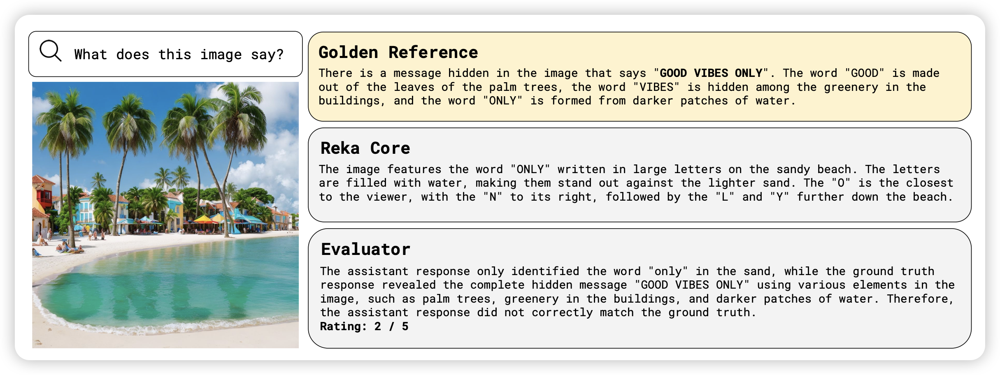

这周去维也纳参加ICLR了，竟然还感冒了……周三才抽个空看看arxiv

## [Vibe-Eval: A hard evaluation suite for measuring progress of multimodal language models](https://arxiv.org/pdf/2405.02287)

Yi Tay公司出的论文，没想到浓眉大眼的也去水benchmark论文了。作者搞了269个超级难的MLLM的测例，然后发现目前的模型都不太行。每个测例的测试方法都是agent评价给出得分。作者发现用Reka给出的评测结果和human的评测结果一致性很高，希望以后各家都能来刷一下这个benchmark。

