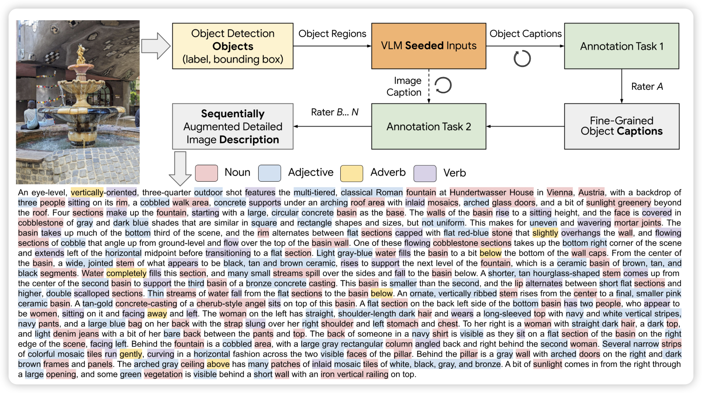
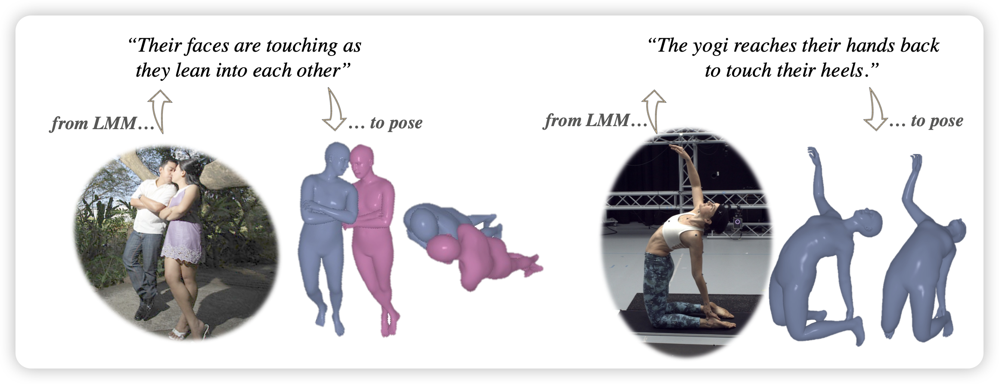
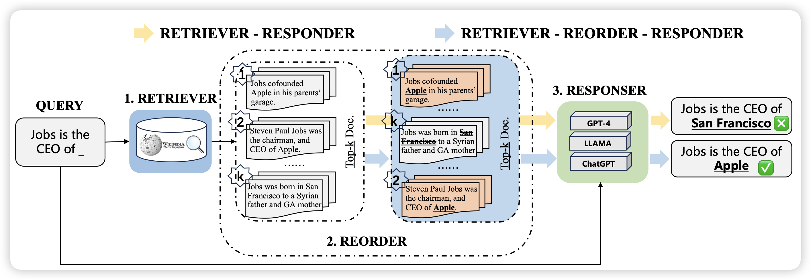
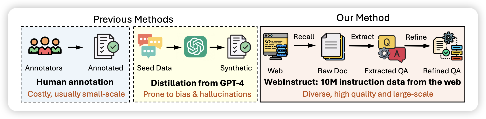

## [ImageInWords: Unlocking Hyper-Detailed Image Descriptions](https://arxiv.org/pdf/2405.02793)
Google的论文，作者发现目前所有的image caption数据集都不够高清、不够细节。作者设计了一套pipeline，结合多种object detection模型之类的方案，让human辅助标注，最终可以快速生成非常高质量、非常高清的image caption。作者发现，通过这种方案训出来的VLM模型，比正常的模型效果好非常多。

## [Pose Priors from Language Models](https://arxiv.org/pdf/2405.03689)

姿态检测领域的文章：这个任务是输入一张人的图片，要3d重建里面的人的姿势。作者认为目前的VLM应该有对于人体姿势的认知，希望可以让VLM对照片先给出一些对于姿态的描述，辅助后面的姿态重建模型做的更好。事实上，确实就好了很多

## [R4: Reinforced Retriever-Reorder-Responder for Retrieval-Augmented Large Language Models](https://arxiv.org/pdf/2405.02659)

作者探索了一个有趣的问题：能不能用rl的方式让retriever学着对结果进行排序，以最终的回答质量来给出reward。作者发现这样训练的模型最终在回答中的事实性更好

## [MAmmoTH2: Scaling Instructions from the Web](https://arxiv.org/pdf/2405.03548)

Ge Zhang的论文。作者探索了能不能从互联网语料里自动构造query-response pair，然后生成比较diverse的SFT数据。作者发现通过这种方案生成10M sft数据以后，直接训模型的效果就很好。

