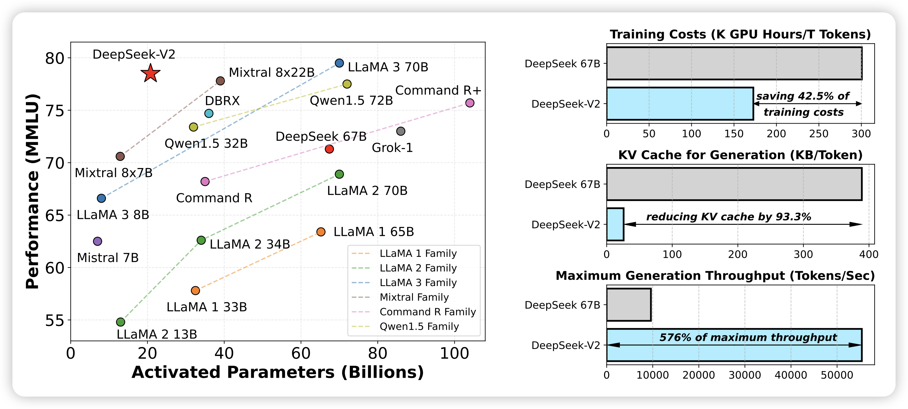
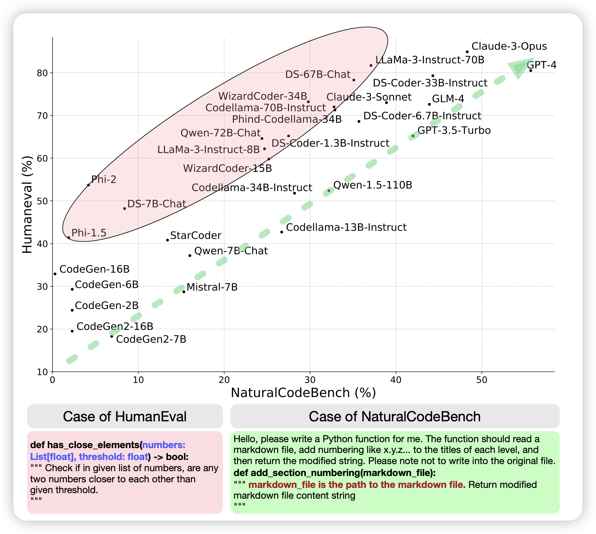

## [**DeepSeek-V2: A Strong, Economical, and Efficient Mixture-of-Experts Language Model**](https://arxiv.org/pdf/2405.04434)

前两天deepseek出了2B的MoE模型，今天大号的挂出来了：236B参数，激活21B，然后效果很好。

> 感觉未来一段时间各家200B左右的MoE模型都要出炉了

## [NaturalCodeBench: Examining Coding Performance Mismatch on HumanEval and Natural User Prompts](https://arxiv.org/pdf/2405.04520)

唐杰老师的文章，想要替代HumanEval。作者发现，HumanEval等传统benchmark中的case都是比较简单，脱离用户真实需求。作者就从online service中构建了400个真实code案例，包含多个领域。

