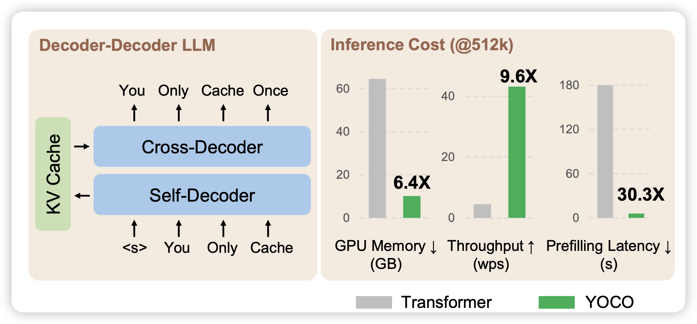

虽然论文比较少，但是下面这篇还是很火的

## [You Only Cache Once: Decoder-Decoder Architectures for Language Models](https://arxiv.org/pdf/2405.05254)

Yutao Sun的顶流论文，作者的思路是：目前模型比较慢主要是因为kv需要每层都计算，这会使得模型的显存、时间等消耗很大。如果只在某几层算一下kv，然后后面的层都复用呢？作者发现这样出来的模型速度快、显存少，而且效果并不差。模型的代码看起来就像是一个decoder-only的模型，所以基本可以很快适配到目前的一些加速框架上

