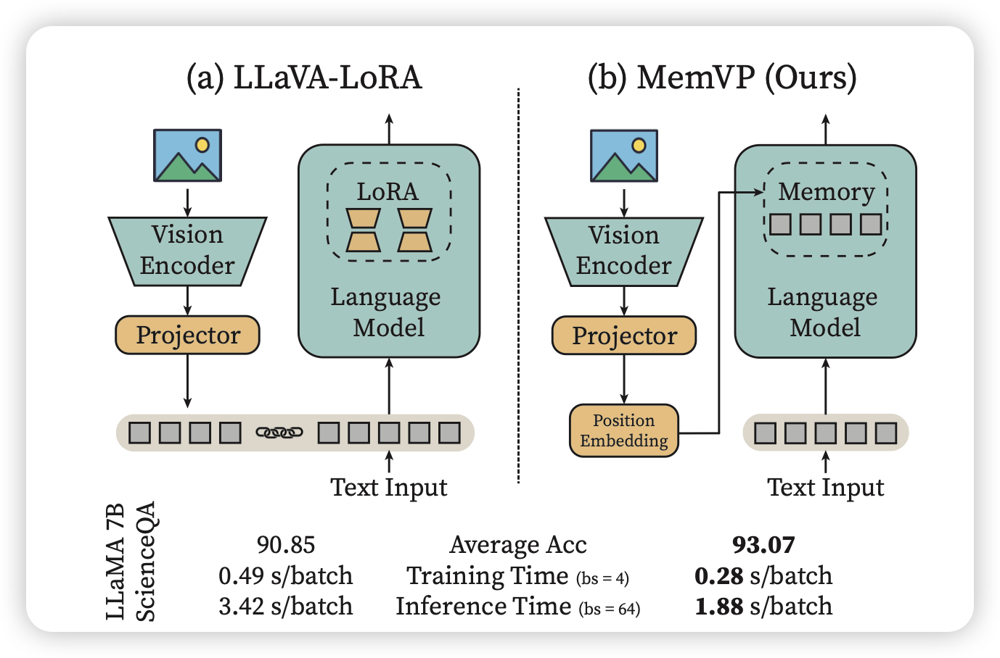

## [Memory-Space Visual Prompting for Efficient Vision-Language Fine-Tuning](https://arxiv.org/pdf/2405.05615)

今年ICML的论文：作者认为常见的  里面需要把vision token拼进模型，开销太大。能不能在FFN层里面注入图片的信息？作者发现这样训出来的模型在保持开销小的同时，效果也很好

