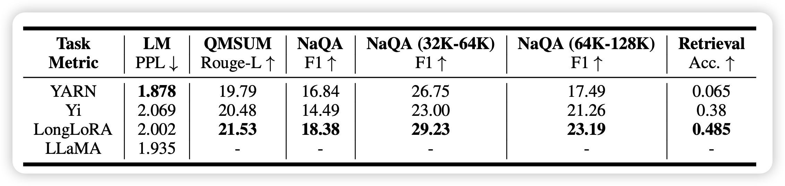

## [**Can Perplexity Reflect Large Language Model's Ability in Long Text Understanding?**](https://arxiv.org/pdf/2405.06105)

一个ICLR的tiny paper，作者认为在长文本建模任务中ppl其实不能代表什么：因为语料的问题，预测next-token在很大程度上只能反映局部的识别能力。作者通过实验也发现了这个现象

> 从这个角度思考，是不是说明对于更好的长文本理解任务，我们应该使用一些非ppl的loss？

