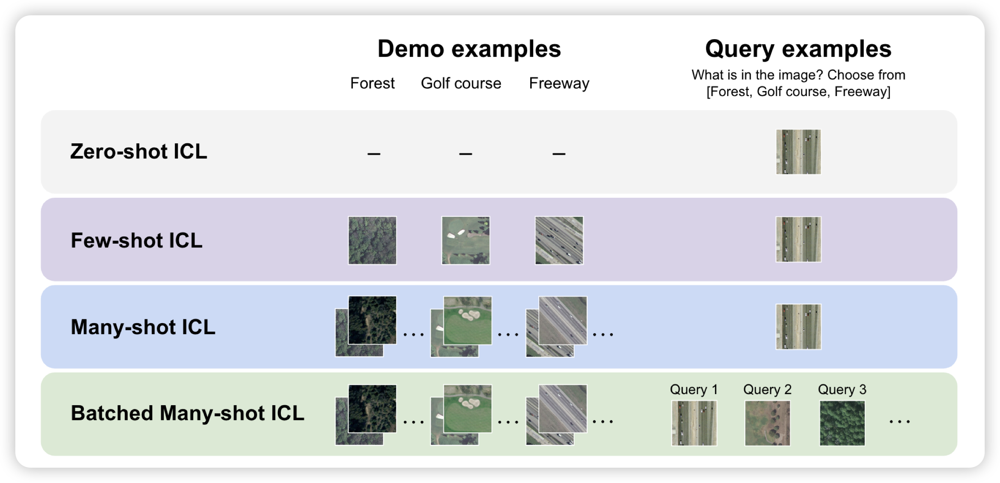
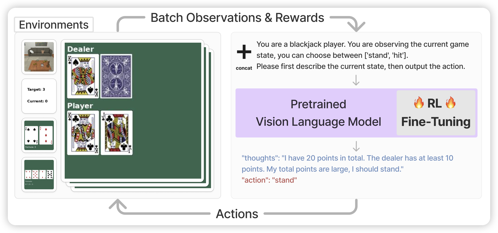

## [Many-Shot In-Context Learning in Multimodal Foundation Models](https://arxiv.org/pdf/2405.09798)

如果大家还记得那个manyshot in-context learning，今天stanford在VLM里测试了效果。他们测试了gpt-4o和Gemini，发现非常多图输入的情况下，performance和样本数基本是符合scaling law的。同时，如果query按照batch的形式给出，一次api call预测多个query，效果会更好。

> 手真快，4o这就测完了……

## [Fine-Tuning Large Vision-Language Models as Decision-Making Agents via Reinforcement Learning](https://arxiv.org/pdf/2405.10292)

Berkeley的文章，作者竟然有LeCun。如果大家还记得之前deepmind那篇 when ReAct meets ReFT，这篇是在vlm领域做的：让一个vlm agent通过CoT的方式生成trace，然后给出Reward，进而使用rl优化：作者发现训练以后的7B模型可以在特定任务上超过GPT4

> 很基础的研究：没想到现在才有工作推出来

