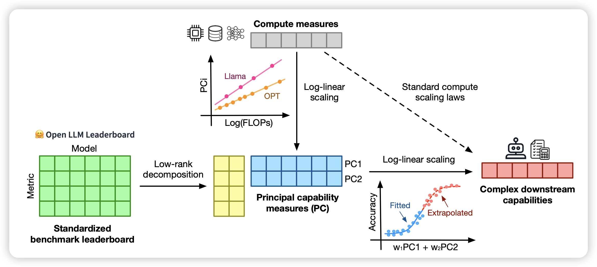

## [Observational Scaling Laws and the Predictability of Language Model Performance](https://arxiv.org/pdf/2405.10938)

一篇研究predictable scaling的论文：作者发现把已有的benchmark-perf和flop作为两个维度进行矩阵分解，就可以得到一个准确度不错的embedding来进行后面的拟合

