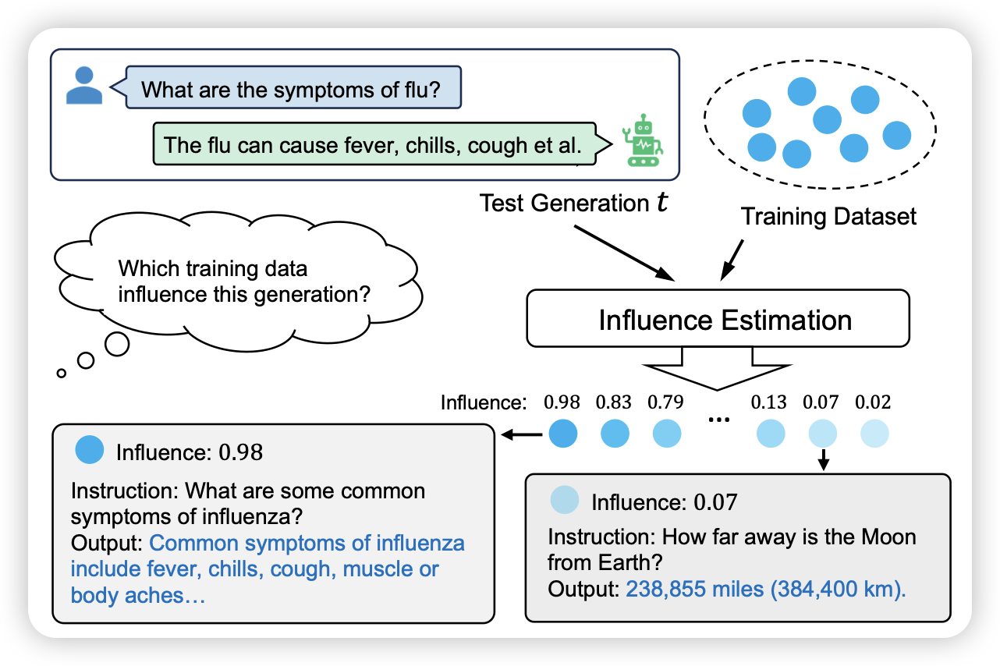

最近想到一些新东西，又开始读论文模式了

## [Token-wise Influential Training Data Retrieval for Large Language Models](https://arxiv.org/pdf/2405.11724)

这篇是influence function research line的论文：作者想要找到模型的每个输出里，对他影响最大的训练数据是什么。这次的方案是把训练数据里的梯度用某种方法压缩存起来，然后可以用一个模型retreive回来影响最大的数据。

> 我有个疑惑，这种方案和text embedding算cosine相似度是不是一样的？其实也是需要一些训练数据然后就是正/负样本，理论上dense的方案也能work

