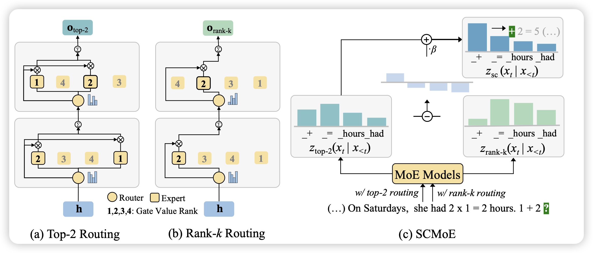
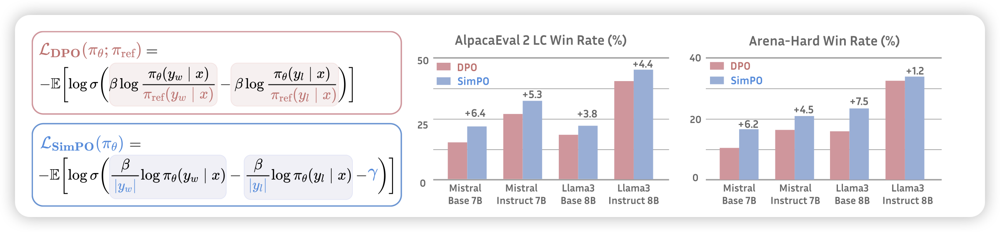
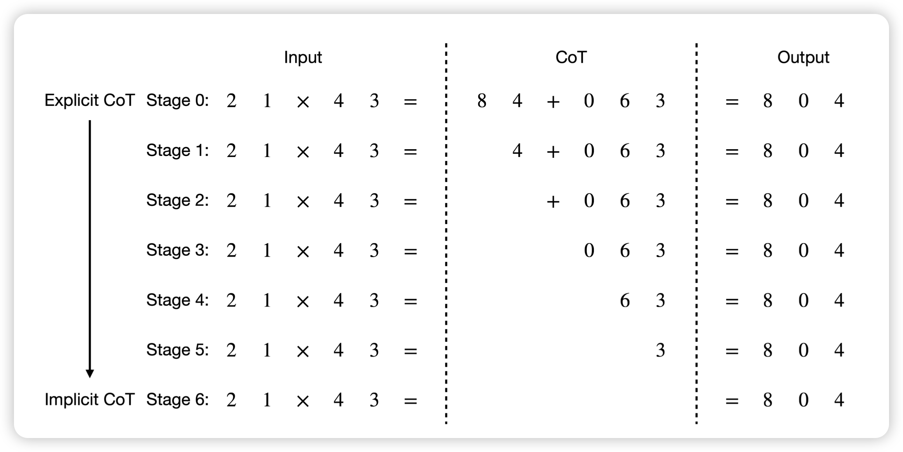

昨天arxiv没更新，没想到今天一更新就是196篇……重量级

## [Unchosen Experts Can Contribute Too: Unleashing MoE Models’ Power by Self-Contrast](https://arxiv.org/pdf/2405.14507)

作者发现，目前的MoE模型里，没激活的token完全没用上，这里面有优化的空间。作者想了个招数，如果求出不同的激活方式的差值，这个差值应该就考虑未激活专家的内容了。作者发现这种方法不需要额外训练，也基本不用额外引入推理开销，竟然能在所有任务上提升效果？而且涨的还挺多

> 啊？那训练的时候也可以这么搞吗……

## [SimPO: Simple Preference Optimization with a Reference-Free Reward](https://arxiv.org/pdf/2405.14734)

Danqi的论文，这下不得不推了：作者想到了一个简单的DPO改进，用模型自己的logits作为隐式的reward，一下子连ref model都省了，真成sft了。然后发现这种简单的方案训练出来的模型实际上比已有算法都好，使用llama3作为base model，训出来了目前最强的8B模型。

## [From Explicit CoT to Implicit CoT: Learning to Internalize CoT Step by Step](https://arxiv.org/pdf/2405.14838)

Yejin Choi的论文，作者的思路很简单：模型通过多步调用获取CoT的能力，那么模型能不能不用CoT也和之前效果一样呢？作者想了个很简单的办法，先生成CoT的正确样本，在训练的时候逐渐只保留最后的后缀，最终训练数据里就是direct answer。作者发现这种方案训练出来的模型在GSM8k上不用CoT，直接就能有50%的acc

> 有点神奇

