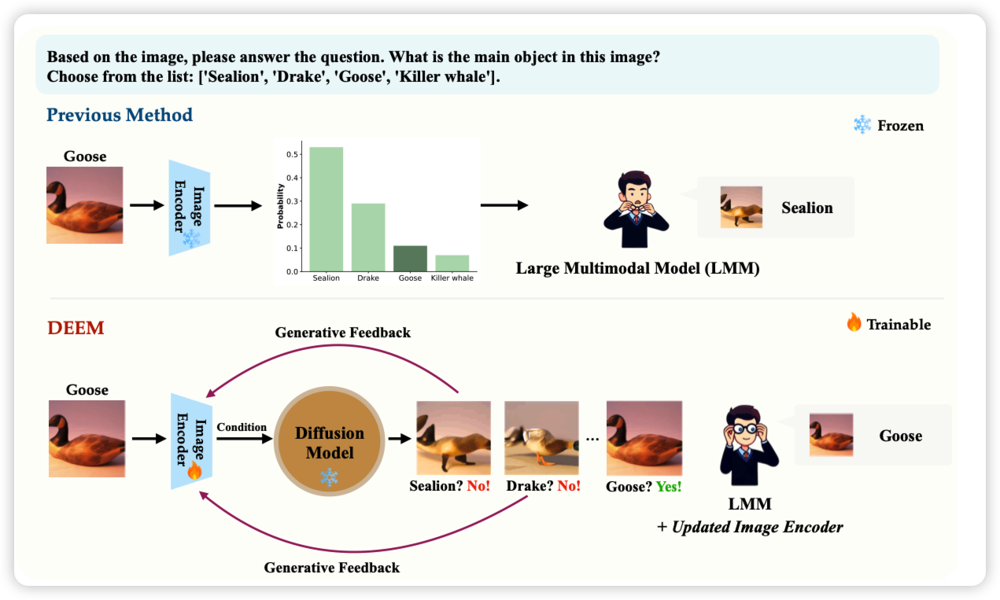
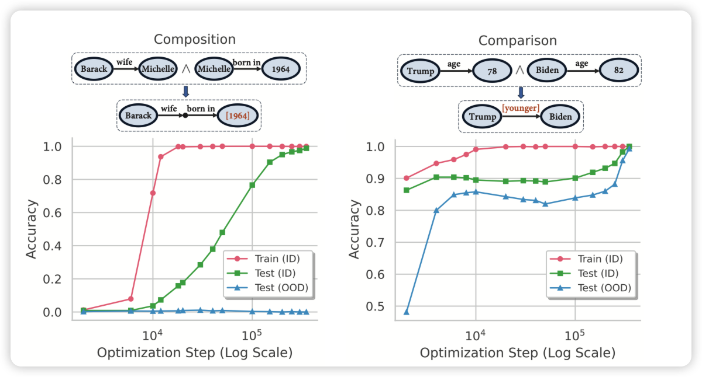
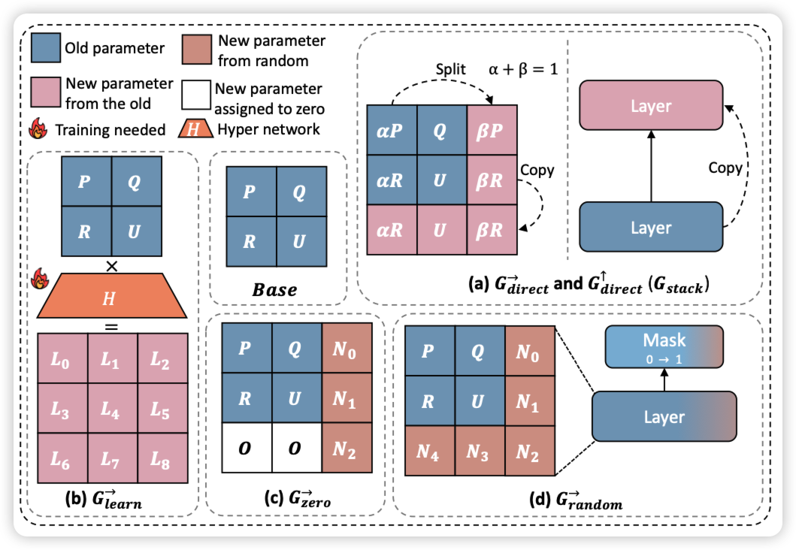

发现好多天没更新阅读笔记了，写一个manyshot ICL的笔记吧：最近看到的论文里最有意思的一篇

## [DEEM: Diffusion Models Serve as the EyEs of Large Language Models for Image Perception](https://arxiv.org/pdf/2405.15232)

有趣的思路：作者在思考目前的VLM做不好是不是因为这种"llava系"模型架构设计里面image encoder的损失比较大，所以作者想要直接调整image encoder的效果。作者构造了一种类似re-consturction的思路：把image encoder的embedding丢给一个图片解码模型，从解码出目标图片的loss里反馈image embedding的梯度反过来优化image encoder。通过这种"reverse"的思路，减少了VLM的hallucination

> 感觉有点奇怪……有点像是andrew前几天那个的在embedding层加CLIP loss思路的对偶版本

## [Grokked Transformers are Implicit Reasoners: A Mechanistic Journey to the Edge of Generalization](https://arxiv.org/pdf/2405.15071)

grokking领域的论文，好久没关注这个方向了。这个方向讲的东西是，随着训练量加大，在训练集早就已经过拟合的情况下，模型在测试集的表现会不会逐步上升、或者突变，Ilya曾经研究过这个。今天这篇论文讲的是transformer reasoning这个领域会不会存在grokking的性质。作者在合成的场景下验证了这个事情。

> 有没有试着再更泛的agent任务上试验一下？

## [Stacking Your Transformers: A Closer Look at Model Growth for Efficient LLM Pre-Training](https://arxiv.org/pdf/2405.15319)

Jie Fu的论文，最近怎么好多这种"a closer look at..."格式。作者聚焦于用小模型启动训练一个大模型这个研究方向，分析了目前方法的的主要瓶颈，同时提出了一个新的$G_{stack}$算子，从scaling的角度分析他对于不同大小、不同训练量的模型都效果不错

