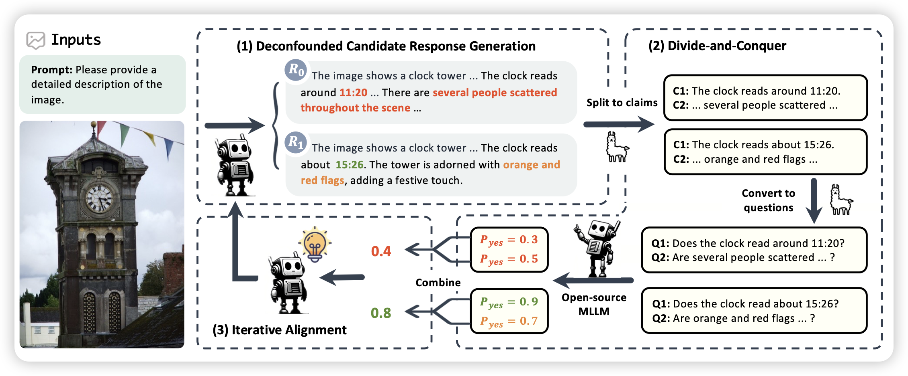
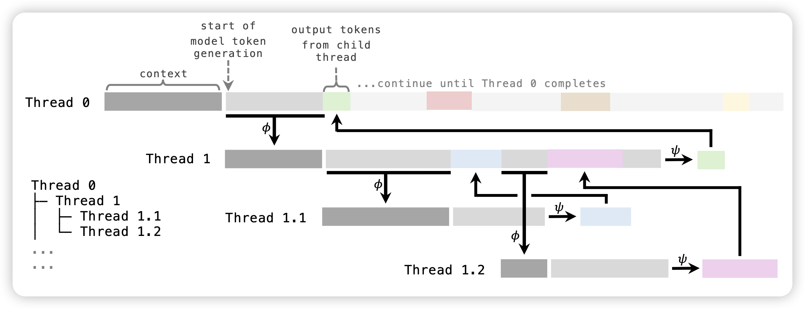

## [RLAIF-V: Aligning MLLMs through Open-Source AI Feedback for Super GPT-4V Trustworthiness](https://arxiv.org/pdf/2405.17220)

推荐我们组的工作：方法论有点像是之前那篇LLM fact check。作者定义了一套自动对模型评分给feedback的pipeline：

1. 输入两个response pair
2. 先提取里面所有的陈述
3. 对于所有的陈述转换成对应的问题
4. 让另一个模型逐个回答这些问题对不对
5. 根据陈述的正确性给出原始response的正确性，作为feedback

作者发现，根据这套pipeline，可以极大地进行self-training，减少模型的hallicination

## [THREAD: Thinking Deeper with Recursive Spawning](https://arxiv.org/pdf/2405.17402)

挺久没推reasoning领域的论文了，不过这个mit的工作看起来还挺有趣的：作者从之前tree of thought那些地方得到了灵感，很多任务在做拆解等时是可以并行的，所以作者定义了一个thread的概念，模型做出分解后，子线程就可以自己跑自己的了，直到最后拿到一个答案。然后上层线程可以汇总下层的信息做出后面的决策、或者换新的方法。

