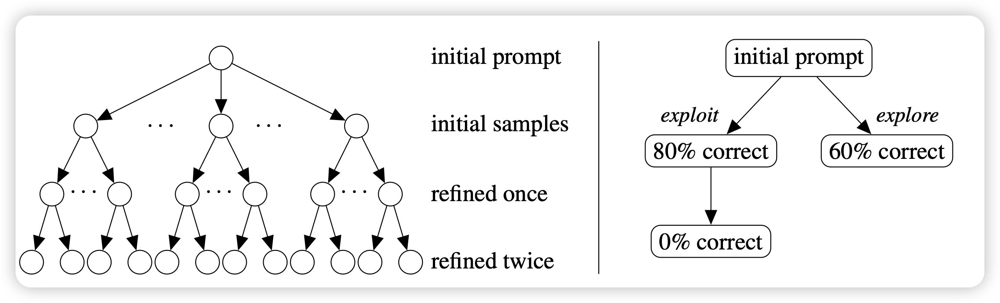
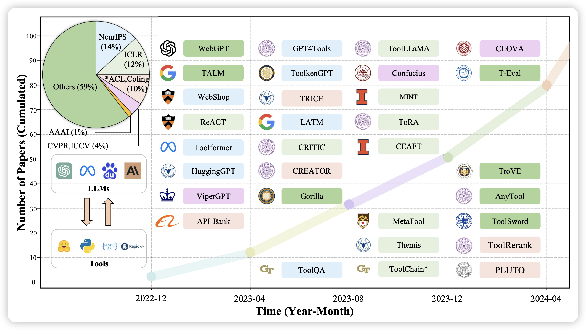

昨天忘记更新了，今天把两天的都补上

## [Code Repair with LLMs gives an Exploration-Exploitation Tradeoff](https://arxiv.org/pdf/2405.17503)
ToT领域的论文，作者在code refine任务上实验：每次生成一个代码会说明test case过了没有，让模型多次迭代代码。作者认为这个场景是一个arm-acquiring bandit场景，然后尝试了平衡exploration与exploitation的算法

## [Tool Learning with Large Language Models: A Survey](https://arxiv.org/pdf/2405.17935)

我们组大概在一年之前出过一篇tool learning的survey，现在看其实有点过时了。今天人大又出了一篇survey，讲了最近一段时间工具学习领域的进展，感觉还是不错的

