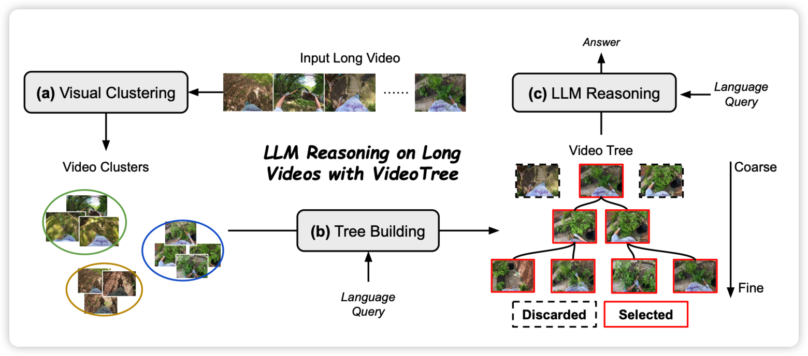
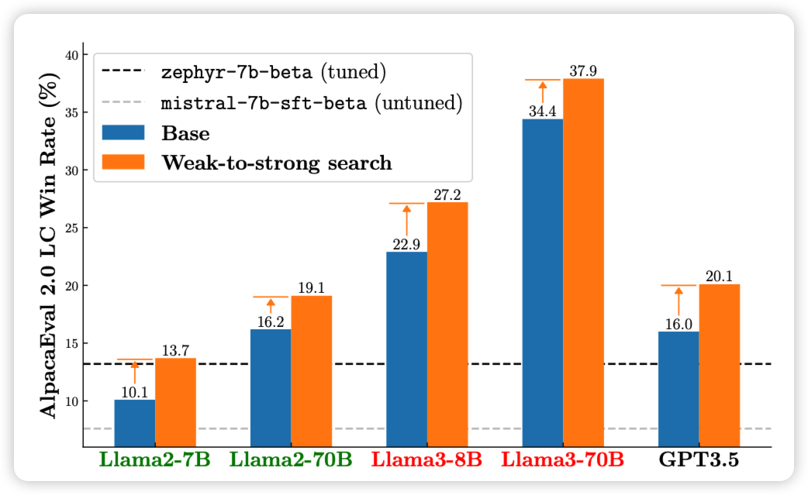

今天引用破400了，不知道能不能在毕业的时候破千……

## [VideoTree: Adaptive Tree-based Video Representation for LLM Reasoning on Long Videos](https://arxiv.org/pdf/2405.19209)

如果大家还记得之前有篇“walking down memory maze”的论文，作者用类似的思路：长视频理解任务中，很多视频内容和问题关系不大，所以能不能把video embedding组织成树状结构，然后根据相似度之类的指标根据query组织注意力区域。由此，作者在很多视频理解benchmark上做到了很好的效果

> emm……这个假设会不会是建立在目前benchmark还不够强的基础上

## [Weak-to-Strong Search: Align Large Language Models via Searching over Small Language Models](https://arxiv.org/pdf/2405.19262)

作者认为，无论是小模型还是大模型，在对齐前后应该有类似的表现，所以如果有一个rlhf前和后的小模型(比如gpt2或者mixtral 7B)，他们的logits差值可以体现出来align的效果。那么，如果有一个没有对齐过的大模型用某种搜索算法来最大化这种logits差值，是不是就可以让大模型找到"类似于对齐后"的答案了呢？作者做了实验，发现还真可以

> 这个招数让我想到了之前diffusion领域有个叫 classifier guidance decoding的技巧，然后做text style transfer的人也有人搞过这个……不知道大家还记不记得

