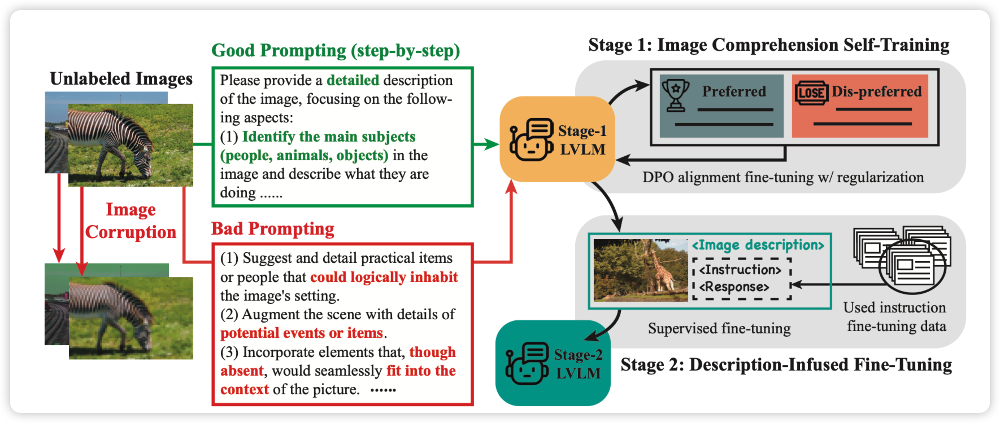
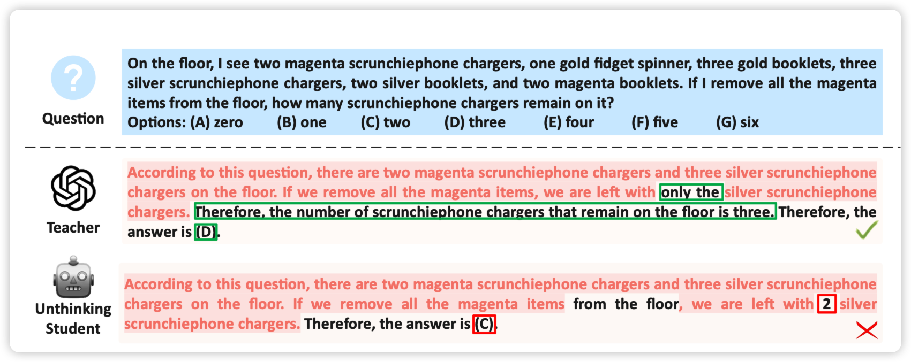
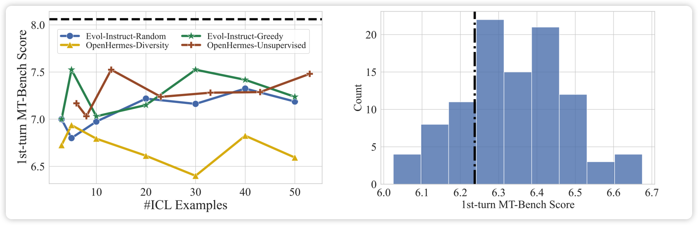

## [Enhancing Large Vision Language Models with Self-Training on Image Comprehension](https://arxiv.org/pdf/2405.19716)

和昨天组里的工作类似，也是一篇self-training增强image caption能力的论文，作者考虑了另外一个归纳偏置：更差的图片的caption倾向于更差，所以作者使用一个图片和他的低分辨率等corrupt版本生成多个caption，由此构造正/负样本。发现效果很好，可以很大程度地减少hallucination

> 眼前一亮，有一种人类智慧的感觉

## [Beyond Imitation: Learning Key Reasoning Steps from Dual Chain-of-Thoughts in Reasoning Distillation](https://arxiv.org/pdf/2405.19737)

作者提出了一套双模型的机制，一个弱模型先对问题进行回答，对于错误的回答，让强模型根据正确答案进行修正。作者认为，这种改动的地方才是最重要“key reasoning steps"，会让模型表现出来很好的效果。

## [Is In-Context Learning Sufficient for Instruction Following in LLMs?](https://arxiv.org/pdf/2405.19874)

这篇工作follow了之前那篇urial的工作：探索模型能不能仅仅通过in-context样本“显得像是做过align”。作者尝试了添加更多样本，但是发现在align场景下，增加in-context并不能显著提升align得分。

> 我主要想问，为什么他们有GPT4-base的score呀……

